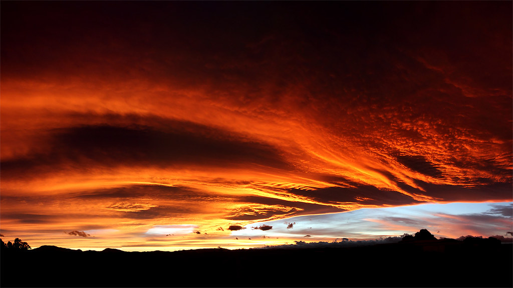

I'm from Aotearoa (New Zealand), was born on the [Heretaunga Plains](https://en.wikipedia.org/wiki/Heretaunga_Plains), and grew up
on the hills of Te Mata Peak. I'm a first generation kiwi -- my mother came
here from Scotland as a Teacher, my father from England as a Mainframe Engineer
, they met sky-diving. I live in Pōneke (Wellington) with my partner [Alanna](https://alanna.space), and two rascal children.
My name is Mix.

:information_source: _Introductions here are
[context-first](https://en.wikipedia.org/wiki/Pepeha), because the "individual"
is better understood by where they stand, and who they relate to._

I'm a nerd -- I love sci-fi, magic the gathering, programming, ecosystem
tuning. I love people and community, so I've spent most of my adult life in
groups of nerds gardening community -- teaching, writing code that serves
people, weaving chat groups, and hosting picnics.

## Double Edged Swords :crossed_swords:

I think many of the things which distiguish us from one another are strengths
in some contexts and weaknesses in others. Understanding these helps us know
in what environments we will thrive, where we might need support, and who we
might work really effectively with

  

    <h3>Precision / Pedantry</h3>
  

I tend to load a lot of detail in when trying to understand something. If I'm
making some discernment/ judgement, I want to understand the veracity, the
context, the relationships. Glossing over detail feels wrong to me. I'd
rather defer -- keeping possibiility space open -- than jumping to wrong
conclusion.

**Positives** :+1:
  - a very thorough reader
  - spots edge cases in systems (quirks which lead to unintended consequences)
  - asks incisive questions
  - understands deeply
  - forebearant

**Negatives** :-1:
  - a slow reader
  - analysis paralysis (load more context than is needed)
  - mistaken for being critical (understanding == care though!)
  - stickler for words
  - slow to label bad actors

  

    <h3>Attentive / Distractable</h3>
  

Sensory input (particularly aural, visual) that is out of place or unusual
stand out a lot to me. This isn't to say I have super-hearing, or
super-sight, rather what I make of these inputs is a little different to
others.

**Positives** :+1:
  - quick-finds lost items (I remember "Matter Out of Place" and remember)
  - proactly identificaties broken things (electronics, pipes, machinary)
  - hears upset children
  - hears stuck animals

**Negatives** :-1:
  - odd sounds pull my attention like a fox (out of conversation)
  - struggle to parse voices in crowded / reverberant environments
  - annoyed by dying flourescent lights

  

    <h3>Long-game / Over-optimised</h3>
  

When I find something I love in the world, or perceive has potential for
greatness, I often as "how could more people benefit from this?" or "what
would further enhance this?". I'm thinking in the long term, about scaling
the pattern I see, and ensuring it's longevity.

**Positives** :+1:
  - sings praise for beautiful patterns
  - amazing first-follower / cheerleader / support character to others
  - unperturbed by any short-term awkwardness (e.g. love giving constructive feedback)

**Negatives** :-1:
  - jump too far ahead
  - chronic feedback (it can be very hard for me to not share important data)

:construction: -- WIP: I've got more I want to add here :sweat_smile:

## Wider Narrative :people_holding_hands:

You shouldn't trust people's narratives about themselves. Here's some other
takes. If you think there are things missing, get in touch and I'll update <3

> _Notices the little things and helps people with their little things with
> unstoppable generosity to make their life better_ -- [Chelsea
> Robinson](https://chelsearobinson.me/)

> _Had a ton of creative ideas, wrote new software to explore those ideas
> (either UI or backend modules), as well as documentation and specifications.
> But I want to specifically highlight his people skills. I can easily say that
> Mix was the heart of [Scuttlebutt](/p/scuttlebutt). Dominic Tarr definitely
> created it, but Mix played a unique role that hardly anyone else did: he
> welcomed and cared for every newcomer, was a mediator in discussions,
> proactively connected people outside with people inside, and fostered
> collaboration across projects_ -- [Andre Staltz](https://staltz.com/)

> _Always on the lookout for energy-optimisation in the best possible way_ --
> [Gina Rembe](https://www.linkedin.com/in/gina-rembe-3a607014/)

> _A kindred curiosity spirit. Asking questions, and enquiring. Often
> about stuff I have no clue about, but with a deep interest that I respect_
> -- [Silvia Zuur](https://www.linkedin.com/in/silviazuur/)

## Contact :pencil:

You can contact me at `hello@mixmix.nz`

