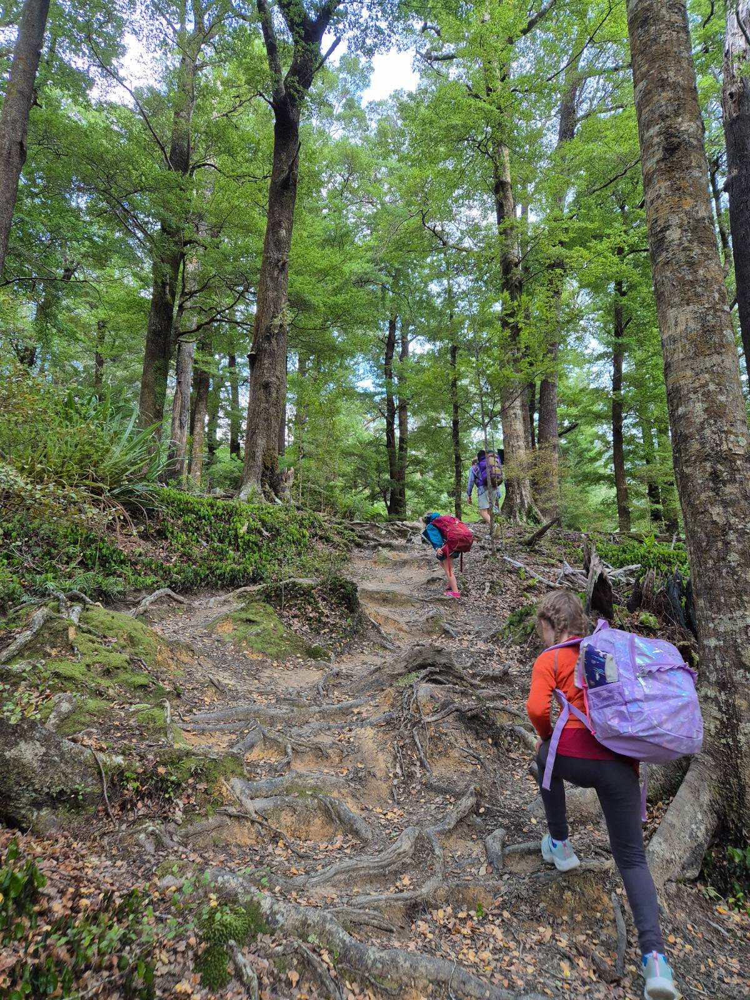
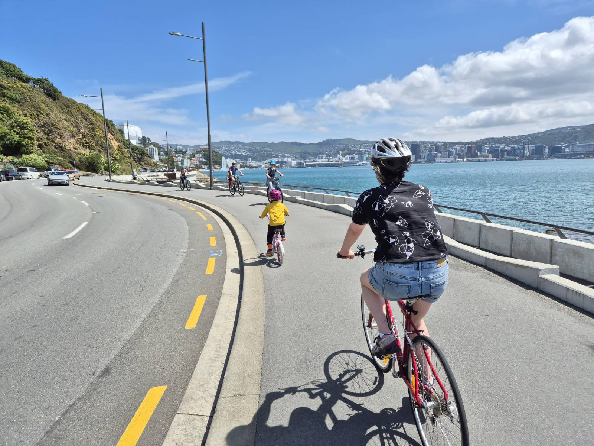
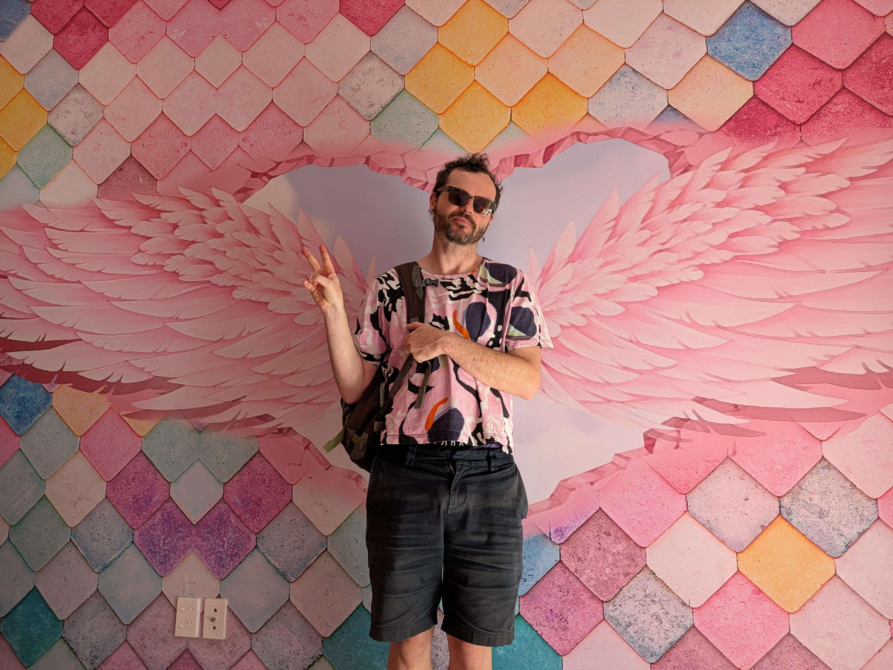
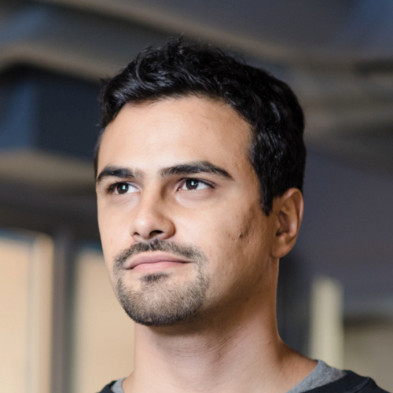
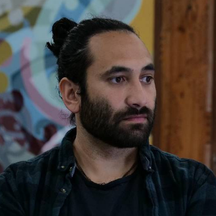
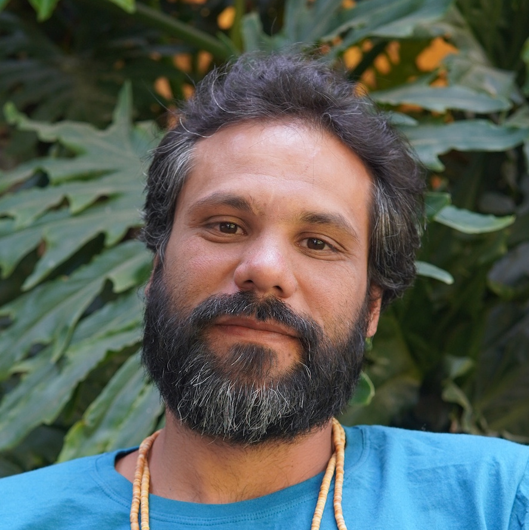

I'm from Aotearoa (New Zealand), was born on the [Heretaunga
Plains](https://en.wikipedia.org/wiki/Heretaunga_Plains), and grew up on the
hills of Te Mata Peak. I'm a first generation kiwi -- my mother came here from
Scotland as a Teacher, my father from England as a Mainframe Engineer , they met
sky-diving. I live in Pōneke (Wellington) with my partner
[Alanna](https://alanna.space), and two rascal children. My name is Mix.

:information_source: _Introductions in NZ are
[context-first](https://en.wikipedia.org/wiki/Pepeha) -- the "individual"
is better understood by where they stand, and who they relate to._

I'm a nerd -- I love sci-fi, magic the gathering, programming, ecosystem
tuning. I love people and community, so I've spent most of my adult life in
groups of nerds gardening community -- teaching, writing code that serves
people, weaving chat groups, and hosting picnics.

## Double Edged Swords :crossed_swords:

I think many of the things which distinguish us from one another are strengths
in some contexts and weaknesses in others. Understanding these helps us know
in what environments we will thrive, where we might need support, and who we
might work really effectively with

  

    <h3>Precision</h3>
  

I tend to load a lot of detail in when trying to understand something. If I'm
making some discernment/ judgement, I want to understand the veracity, the
context, the relationships. Glossing over detail feels wrong to me. I'd
rather defer -- keeping possibility space open -- than jumping to wrong
conclusion.

**Positives** :+1:
  - very thorough reader
  - spots edge cases in systems _(quirks which lead to unintended consequences)_
  - asks incisive questions
  - understands deeply
  - forebearant _(not quick to judge)_

**Negatives** :-1:
  - slow reader
  - analysis paralysis (load more context than is needed)
  - mistaken for critic/ pedant _(deep understanding == care though!)_
  - stickler for words
  - slow to label bad actors

  

    <h3>Sensitivity</h3> <!-- Wide-sense? -->
  

Sensory input (particularly aural, visual) that is out of place or unusual
stand out a lot to me. I don't think I have super-powered sense organs, rather 
my sense processing is tuned a little different than others.

**Positives** :+1:
  - spots errors
  - matter-out-of-place memory → quick at finding
  - finds broken things _(electronics, pipes, machinery)_
  - hears upset children/ stuck animals
  - can rock-hop at speed

**Negatives** :-1:
  - odd sounds pull my attention like a fox _(out of conversation)_
  - struggle to parse voices in crowded / reverberant environments
  - annoyed by dying fluorescent tubes
  - disturbed by tree pruning / removal

  

    <h3>Long-game</h3>
  

When I find something I love in the world, or something that has potential for
greatness, I often ask myself _"how could more people benefit from this?"_ or
_"what would further enhance this?"_. I'm thinking in the long term, about scaling
the pattern I see, and ensuring it's accessibility and longevity.

**Positives** :+1:
  - sees potentials
  - amazing first-follower / cheerleader / support character
  - active bridger and weaver of people
  - unperturbed by short-term social costs
    - _loves constructive feedback_
    - _asks questions so minorities don't have to_
    - _breaks ice_

**Negatives** :-1:
  - jumps too far ahead
  - chronic feedback _(it can be very hard for me to not share important data)_

:construction: -- _more to write here_

## Second Opinion :people_holding_hands:

You shouldn't necessarily trust people's narratives about themselves. Here's
what some friends say about me. If you think there are things missing, get in
touch and I'll update <3

  <a class="header" href="https://chelsearobinson.me/" >
    
    

      Chelsea Robinson
    

  </a>
  

    Notices the little things and helps people with their little things with
        unstoppable generosity to make their life better.
  

  <a class="header" href="https://staltz.com/" >
    
    

      Andre Staltz
    

  </a>
  

    Had a ton of creative ideas, wrote new software to explore those ideas
        (either UI or backend modules), as well as documentation and
        specifications.
    But I want to specifically highlight his people skills. I can easily say
        that Mix was the heart of <a href="/p/scuttlebutt">Scuttlebutt</a>
    <!--
        Dominic Tarr definitely
        created it, but Mix played a unique role that hardly anyone else did:
    -->
    - he welcomed and cared for every newcomer, was a mediator in
        discussions, proactively connected people outside with people inside,
        and fostered collaboration across projects.
  

  <a class="header" href="https://www.linkedin.com/in/gina-rembe-3a607014/" >
    
    

      Gina Rembe
    

  </a>
  

    Always on the lookout for energy-optimisation in the best possible way.
  

  <a class="header" href="https://www.linkedin.com/in/silviazuur/" >
    
    

      Silvia Zuur
    

  </a>
  

    A kindred curiosity spirit. Asking questions, and enquiring. Often
    about stuff I have no clue about, but with a deep interest that I respect.
  

  <a class="header" href="https://www.linkedin.com/in/ben-tairea/" >
    
    

      Ben Tairea
    

  </a>
  

    An amazing developer, a great coordinator and communicator, and a good
        friend.
    I've had the privilege of working with Mix for the past 6 years building
        complex systems, bridging the gap between culture and technology.
    <!--
    I have learnt from him, working at his side.
    He was employed as our head of technology, but he also contributed to (and
        at times led) finances, fundraising efforts and project management.
    -->
    He has helped shape not only the technology we built, but also the type of
        organisation we wanted be.
  

  <a class="header" href="https://awana.digital/team/luandro-vieira" >
    
    

      Luandro Vieira
    

  </a>
  

    Mix knows how to unlock more than just encrypted systems, he unlocks
        potential in people. With the mind of an engineer and the heart of a
        community gardener, he never enters alone. He brings others with him,
        opening paths that change lives. Mine was one of them.
  

<!--

  <a class="header" href="" >
    
    

      
    

  </a>
  

  

-->

## Work :balance_scale:

**Status** -- I'm currently available for work!

My specialisations include:
- Data-sovereignty, digital identity, peer-2-peer networks
- Bridging the technical with Community/ Org
- Collective leadership, co-operative organising

I love working on systems that serve humanity :heart: I work with excellent
humans, teams which know how to collaborate, orgs with great leadership.

:heart_on_fire: [**Projects**](/categories/projects) -- things I'm proud to have contributed to
 
:briefcase: [**CV**](/cv) -- a record of my skills & employment

## Contact :pencil:

You can contact me at `hello@mixmix.nz`
 
Prefer to [Signal](https://signal.org/) if we're connected.

