I work on growing systems which help people, ideally communities or soceity.
I've practiced this across many domains and weild tools from education,
social-entereprise, startups, open-source software, parenting. I prioritise
working with excellent humans.

_This page maps raw activities and skills deployed. Check out my [About](/about)
page and [posts](http://localhost:1313/archives/) for a broader picture._

<figure>
  
</figure>

| Entity                                   | Role                                 | Skills                                                                                  |
|------------------------------------------|--------------------------------------|-----------------------------------------------------------------------------------------|
| University of Otago                      | Student _(BSc. Hons. Maths)_         | Mathematics, Physics, Biology, Neuroscience, Tutoring                              |
|                                          | Research Assistant                   | Literature Review, Blood Splatter Modeling                                              |
|                                          | Student _(Post Grad. Dip. Teaching)_ | Pedagogy, Acting, Crowd-control                                                         |
| [Unlimited Paenga Tawhiti](/p/unlimited) | Teacher                              | Customised Learning, Mentoring, Pastoral Care, Bitcoin-trading, Lock-picking  |

<figure>
  
</figure>

| Entity                                   | Role                                   | Skills                                                                                                                                                                                          |
|------------------------------------------|----------------------------------------|-------------------------------------------------------------------------------------------------------------------------------------------------------------------------------------------------|
| [Unlimited Paenga Tawhiti](/p/unlimited) | Teacher                                | (see above)                                                                                                                                                                                     |
| Victoria University                      | Student _(Fine Art)_                   | Parametric Design, Python, Critical Theory                                                                                                                                                 |
| Loomio                                   | Owner, Programmer                      | Ruby, Javascript, i18n Facilitation, Retrospectives, Scrum Master, Translation Coordination                                                                                           |
| Cobudget                                 | Programmer                             | Ruby, Javascript, i18n                                                                                                                                                                          |
| POC21                                    | Support Team                           | System Tuner, Facilitator                                                                                                                                                                       |
| [Scuttlebutt](/p/scuttlebutt)            | Programmer, Community Gardener, Leader | NodeJS, GraphQL, React/ Vue, Distributed Ledgers, P2P, CRDT, Technical Specification, Cryptography, Architecture, UX + UI, Strategy, Facilitation, Grant Management, Community Growth, ... |
| [Protozoa](/p/protozoa)                  | Owner                                  | Business Process, Radical Income Sharing, DEI work, Facilitation                                                                                                                                |
| [Dark Crystal](/p/dark-crystal)          | Co-founder, Programmer                 | NodeJS, Technical Specification, Cryptography, UX + UI, Facilitation                                                                                                                            |
| [Āhau](/p/ahau)                          | CTO, Programmer                        | Strategy, System Architecture, NodeJS, Vue, GraphQL, Group Encryption, CRDT, Technical Specification, UX + UI, Facilitation, Mentoring, Community support, ...                                  |

:construction: Under Construction 

<figure>
  
</figure>

:construction: Under Construction 

