I work on growing systems which help people, ideally communities or soceity.
I've practiced this across many domains and weild tools from education,
social-entereprise, startups, open-source software, parenting. I prioritise
working with excellent humans.

_This page maps raw activities and skills deployed. Check out my [About](/about)
page and [posts](http://localhost:1313/archives/) for a broader picture._

<figure>
  
</figure>

| Entity              | Role               | Skills |
|:---|:---|:---|
| University of Otago | Student _(BSc. Hons. Maths)_ | Mathematics, Physics, Biology, Neuroscience, Tutoring  |
|                     | Research Assistant | Literature Review, Blood Splatter Modeling
|                     | Student _(Post Grad. Dip. Teaching)_ | Pedagogy, Acting,  Crowd-control                            |
| [Unlimited Paenga Tawhiti](/p/unlimited) | Teacher | Customised Learning, Mentoring, Pastoral Care, Bitcoin-trading, Lock-picking  |

<figure>
  
</figure>

:construction:

<figure>
  
</figure>

:construction:

