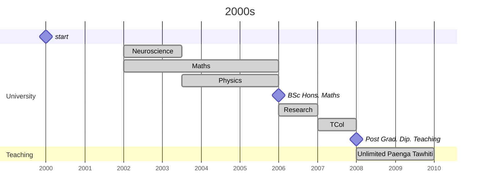
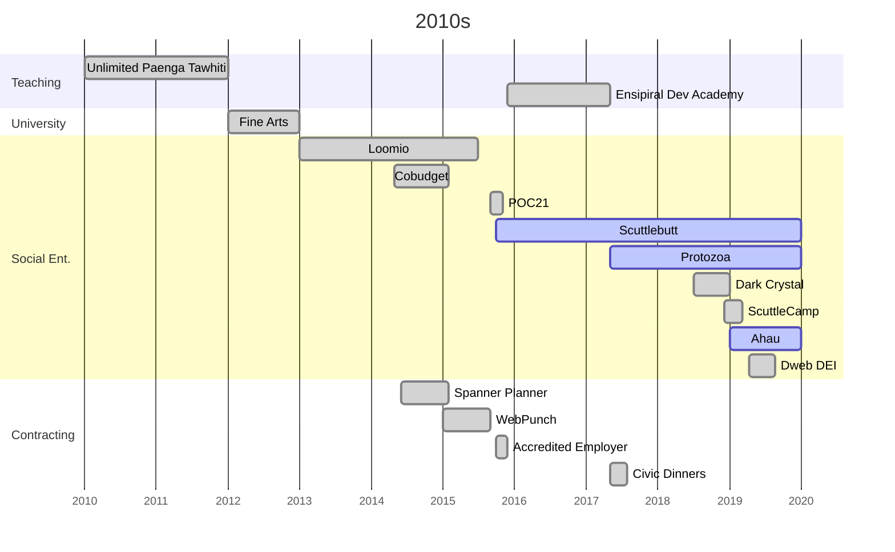

# Timeline

This is the raw mermaid code used to generate SVGs

Process:
1. edit in hackmd.io/new
2. copy raw rendered SVG from DOM
3. format pretty with https://codebeautify.org/svg-formatter-beautifier
4. save as SVG
5. tweak any inline styles






```mermaid 
gantt
  title 2020s
  dateFormat YYYY-MM-DD
  axisFormat %Y
  tickInterval 12month
  
  Section Social Ent.
    Scuttlebutt              :active, 2020-01-01, until last_updated
    Protozoa                 :active, 2020-01-01, until last_updated
    Ahau                     :active, ahau, 2020-01-01, 2024-06-01
    Ahau -> Matou            :milestone, after ahau, 0d
    Matou                    :active, after ahau, until last_updated    
    
    Manyverse, NGI          :done, 2022-05-01, 2023-10-06
    Dweb Scholarships        :done, 2022-06-10, 2022-09-16
    Planetary                :done, 2022-06-23, 6M

    Decent Social            :done, 2024-01-01, 2M
    Dweb Weaving             :done, 2024-06-01, 3M
    Beautiful Signals        :done, 2024-11-01, 2M

  Section Contracting
    Open Measures            :done, 2020-01-01, 6M
    Open Measures            :done, 2022-03-14, 2023-01-10
    
    Entropy                  :done, 2024-05-01, 2025-02-01
    
    
    last updated             :milestone, last_updated, 2025-04-11, 0d
    .                        :milestone done, 2030-01-01, 0d
  ```
