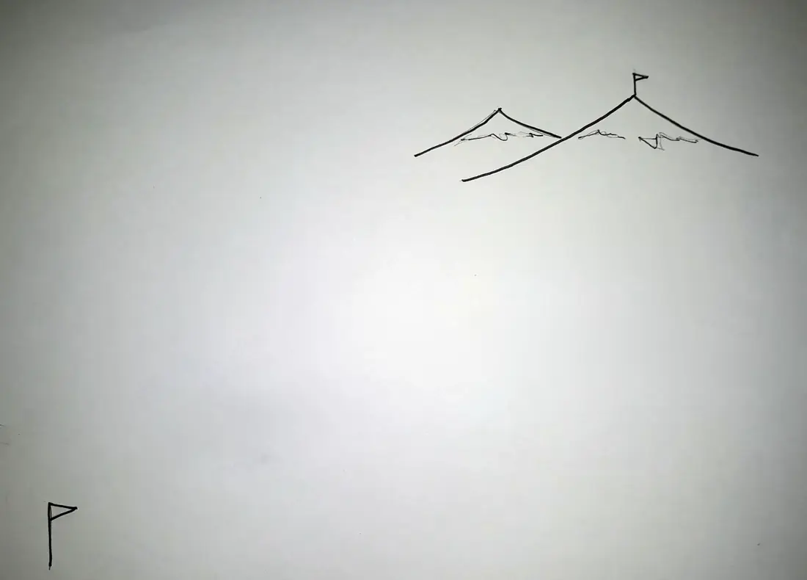

In 2015 I was working in a social enterprise space, and some friends started porting
some of our business tools to their personal relationships.

It started with my friends Chelsea and Ants deciding to date, and to run that
as a series of time-bound experiments. Commit to dating for 1 week, then pause,
reflect, decide whether to continue. Same again for 2, 4, 8 weeks.  We laughed
about that, but in short order several of us were doing periodic
"retrospectives" on our relationships. My partner wrote a blog about our
process -- [Running Agile Scrum on our
Relationship](https://alannairving.medium.com/running-agile-scrum-on-our-relationship-9b2085c5d747#.kwrsvo7rm)
(2016). 

This was picked up by the Multiamory podcast and they iterated on our recipe,
releasing [RADAR](https://www.multiamory.com/radar). We were stoked to hear
other people enjoying this pattern. RADAR is a great resource, though it's a
lot heavier that we can afford to run with small kids. The following is
our current light-weight process.

## A Primer on Iteration

**TL;DR** -- continual improvement rather than perfect plans

Businesses (and relationships) are complex systems in that they have a lot of
moving, deeply inter-related parts, and are embedded in ecosystems. Navigating 
complex systems can be really challenging. There are a bunch of tools that can help,
but my favourate is the "feedback loop".

If you imagine navigating possibility space like wayfinding over an unknown terrain,
your feedback loop is **take a bearing** (where are we now?), **set a course** 
(what should we move towards?), **travel a bit**, repeat:

<figure class="trail-figure">
<picture>
  <source media="(prefers-reduced-motion: reduce)" srcset="trail-still.webp">
  
</picture>
<figcaption>
Take a bearing, set a course, sail for a bit -- repeat. The far peak never moves;
you just keep planting the next flag.
</figcaption>
</figure>

This doesn't preclude having a long term goal / desired destination, but it does
acknowledge that you're moving with a certain amount of "unknown", and complex
interactions may mean you find yourself "off-course" and need adjustments.
What I really want to emphasise is that we discard the impossible ideal of "a
perfect course to desired end" and replace it with "an ongoing journey of
improvement".

In software development we often use Scrum / Agile as a feedback loop to grow
the code... but we ALSO apply the feedback loop to our team process (it's part
of the building, so why not?)

|                   | Software dev.              | Team process                                  |
|-------------------|----------------------------|----------------------------------------------|
| 1. Take a bearing | What have we just built?   | How we feeling about that last round?         |
| 2. Set a course   | What should we build next? | What should the team do different next round? |
| 3. Do a bit       | Write software             | Run team processes                            |
| 4. (repeat)       | | |

In the context of a journey, this would be like a party evolving their roles/
protocols/ processes e.g. _"hey the cook is sick... how about we each take a
turn cooking for the next week?"_.

Retrospective just means "look back", but it's often used as a short hand for
the process where we get together and "Take a bearing" and "Set a course". 
In an Agile/ Scrum context, there's usually a time/ energy constraint -- once
again, the goal is not perfection, it is to use feedback loops to incrementally
improve over time. As long as you trend in a good direction you're winning. This
means things like:
- we may surface 10 issues... but we don't expect to "solve" them all, as long
  as we progress 1 of them in the next sprint, that is progress
- we don't know the the perfect solution to this issue... but we can "try
  something" and see how the system responds... and can try something else next
  time if this doesn't work

## Our Current Process

We run relationship retrospectives ~ once a month, and set aside 90
minutes uninterupted time for our process. This is a ritual which draws a bunch
of energy, so I'd strongly advise not going over 90 minutes - it can burn you
out. This was especially true once we had kids.

Here are the phases of our current process:

### 1. Load Context

Check-in by sharing how we're currently feeling, what we're arriving with _e.g.
I have a didn't sleep well last night; I have a headache._ Remember the last
month, review our calendars, and speak out loud the important landmarks.  e.g.
_We were all sick for a week; You finished your government contract; I finally
got back to my exercise routine; We had that fight._ 

**Time** -- 10-15 min

> **Why** -- In checking in and remembering the last month we're aligning our
> contexts. Knowing I have a headache helps us communicate better by improving
> your model of my current state. Being reminded of what we each found important
> helps prime us for things we might discuss, and factors that are going to feed
> into those conversations.
>
> **Notes** -- Try to avoid "processing" things here, as if you start processing
> here you may blow all your time on something that's not the most important.
> Take the approach of a "reporter naming the facts" with a side of "smile/
> laugh at the good bits".

### 2. Possible Agenda

We write a bullet point list of things would **could** talk about. e.g. _Anxiety
about summer plans; How we're sharing house-hunting labour; That fight we had._

**Time** -- 5 min

> **Notes** -- Avoid "processing" here too

### 3. Prioritise

We decide the top 2-3 things we want to discuss today. We tend to ask ourselves
    - are there any quick wins here?
    - are any of these urgent?
    - which of these are most important?

**Time** -- 1-2 min

> **Why** -- It can be tempting to try and cover everything. Invariably if you
> do this, you end up either rushing / pressurising conversations that would
> have benefitted from the reverse (spaciousness / time), or you just run out of
> time and find you've discussed some bike-shed (superficial) topic while
> something really important was missed.
> 
> **Notes** -- Prioritisation is personal, decide together. We like to tick a
> couple easy things off, and maybe 1-2 chunkier topics. If you feel like
> there's not enough space / time for a topic (good noticing!), name it and
> perhaps ask "can we plan to dicsuss that another time?".

### 4. Discuss

We move through prioritised topics one at a time. The aim is to
  - share some context on the topic
  - listen and be curious together about what's going on
  - ask ourselves "what could we try different?"
  - write down what we agreed to as the final step in discussing a topic 

**Time** -- 60? min

> **Notes** -- We keep notes of "actions" (agreed things someone is gonna do, or
> changes in role/ process) in a shared Signal chat. We check the time and energy
> before launching into another topic -- sometimes changing the priorities to
> fit what's emerged as needed
>
> ⚠️ _Alanna tells me this section deserves a LOT more detail. I stalled out
> publishing this... so maybe it's enough for now to say you need to figure out
> what good processing looks like for your relationship - paying attention to
> optimizing for coherencem, connection, and sustainability._

### 5. Appreciation

We pause, take a breath, then share a bunch of things we appreciate -- about our
partner, our relationship, our life together. One person goes first and runs for
a couple minutes while the other listens, then we switch. We finish with a hug.

**Time** -- 5 min

> **Why** -- This whole process can be quite "problem-solving" heavy, and
> emotionally charged. I usually feel great about the connection and
> problem-solving, but this ensures we finish on a really sweet high.

## What Retrospectives Miss

...loading

