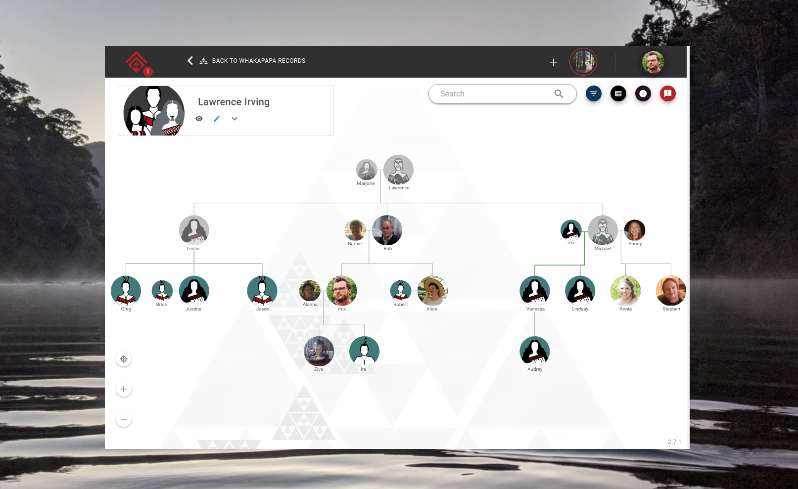
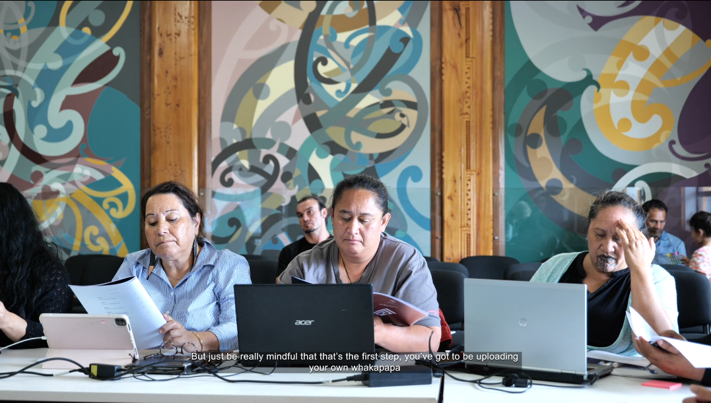
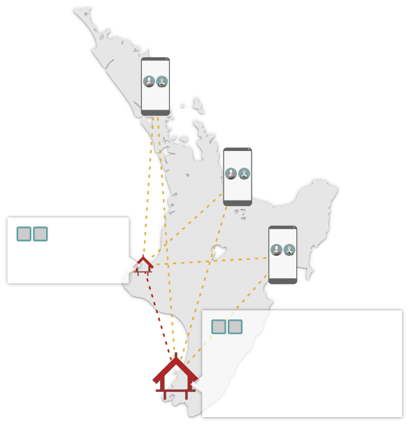

> ⏳ 2019 -- 2024  
> 🌱 has evolved into [Mātou](/p/matou)

## About

Āhau is an desktop + phone application for creating collaborative family trees,
and the archiving of records which are linked to that family (photos, videos,
documents).

In Te Ao Māori, relationships with family (and land) form the foundation from
which all identity, sense making, and coordination flow. Āhau was designed to
help strengthen this foundation, and be infrastructure that was held by the
people -- identity is precious taonga (treasure) after all.

To make self-hosting accessible, Āhau was built on top of a peer-2-peer system
called [Scuttlebutt](https://scuttlebutt.nz). This put data in community hands
(not the company's), and the distributed nature meant any servers were just
light-weight relays which anyone in a family could run from home on a computer.

  

  Click to see animated
  

  

> :information_source:
_There's a lot more I could write on this topic. I'm really passionate about
what we worked on and achieved, so if you're interested to learn more please
ask, or check out [these](/p/govis-2023/) [talks](/p/fosdem-22/)_

## Relationship

When I first met this project they were exploring blockchains as a space. I
reached out to offer my learning from the more pluralistic p2p/ Distributed
Ledger space. Our collaboration blossomed into a longer term working
partnership, where I took on the role of technical leader / CTO.

I've formed life long relationships with the team that worked on this. Honestly
being part of a Māori team has been an absolute honour and joy.

## Leadership

Some of the things I lead out on
- establishing internal processes
    - retrospectives
    - sprints
- integrating tikanga into our work
    - working with community leaders to design software which serves their needs
    - karakia are embedded into our codebase
- education
    - mentoring Māori graduates from Waikato
    - working with a designer to produce animated infographics to make p2p
      concepts more accessible
    - conference talks
- fostering international partnerships
    - p2panda, Awana Digital, Earth Defenders Toolkit
    - Internet Archive / Dweb Camp

## Technical

I designed and built many things (along and with others) but these are the what
I'm most proud of :

| Library | Description |
|---|---|
| [envelope-spec](https://github.com/ssbc/envelope-spec/), [private-group-spec](https://github.com/ssbc/private-group-spec) | A large-scale group encryption specifications |
| [ssb-tribes](https://www.npmjs.com/package/ssb-tribes) | Implementation of above specs in Scuttlebutt |
| [artefact-server](https://www.npmjs.com/package/artefact-server) | Encrypted, streaming, peer-2-peer video |
| [ssb-crut](https://www.npmjs.com/package/ssb-crut) | A byzantine fault-tolerant [CRDT](https://en.wikipedia.org/wiki/Conflict-free_replicated_data_type) |
| [ssb-atala-prism](https://www.npmjs.com/package/ssb-atala-prism) | Plugin which adds Verifiable Credentials to Āhau |
| [ahau-graphql-server](https://www.npmjs.com/package/ahau-graphql-server) | A GraphQL endpoint which made UI dev more accessible for all our developers |

Code within Āhau:
- an algorithm for progressively loading huge family trees (5000+ people)
  smoothly
- export function which converts a D3 tree into an SVG with embedded images
    - this was to support a community member to create an updated whakapapa 10
      meters wide, 2 meters high, including 1200 people.

