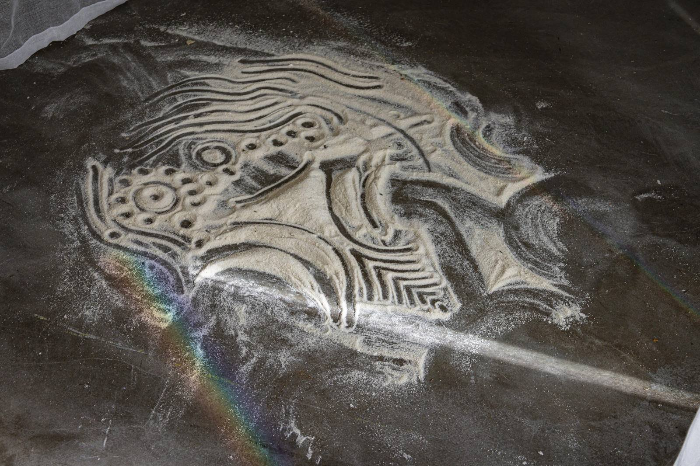
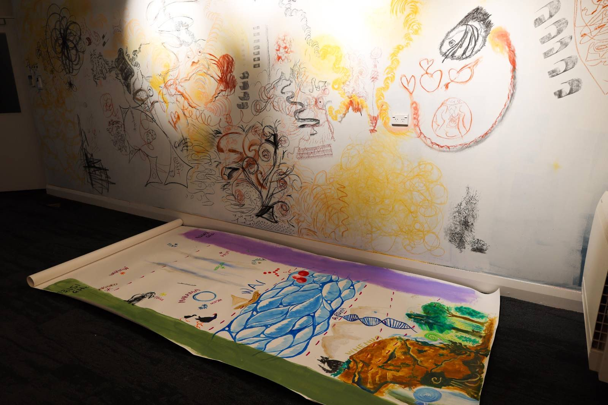
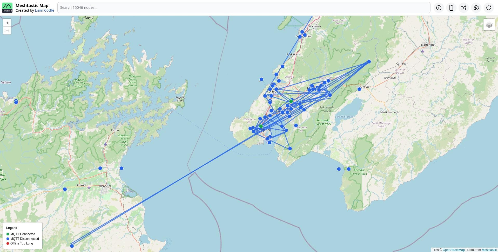
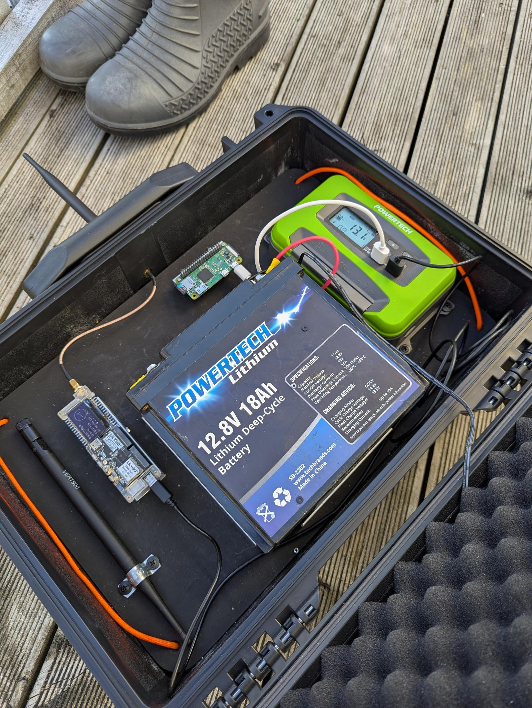
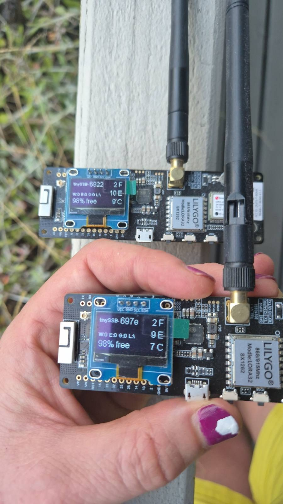
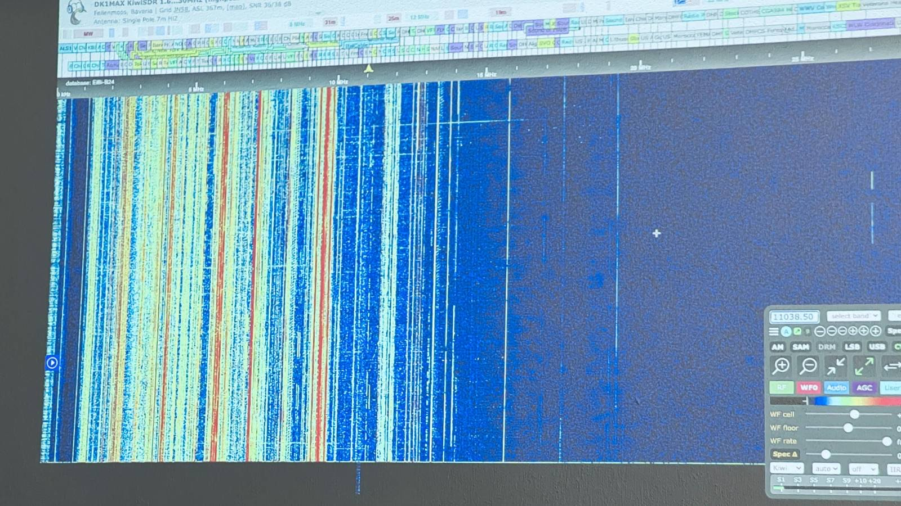

> Beautiful Signals is an event series engaging art practices and a series of
> self-run workshops that explore emerging issues with soil, food, data,
> democracy and digital sovereignty

This was a project brought together by an emerging group of Pōneke activists/
programmers/ artists/ community organisers. I helped pull the website together,
and also hosted a workshop on [Māori Data
Sovereignty](https://beautifulsignals.nz/workshops/maori_data_sovereignty/).

