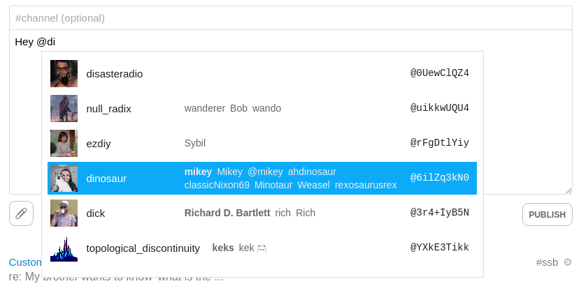

_[Protozoa](https://www.protozoa.nz) is a tech coop, and we write open source code.
This is a little bit about what that means, and how open source is the foundation on which we're building an aspirational future._

I recently published a new feauture for [Patchbay](https://github.com/ssbc/patchbay) - an open source project I maintain.
It allows you to easily @-mention people in the [scuttleverse](https://www.scuttlebutt.nz).
This isn't straightforward because it's a decentralised space where identity is subjective - many people have more than one use-name. (I gave [a whole talk on subjectiviy here](https://www.youtube.com/watch?v=P5K18XssVBg)).

_I mention Mikey by a name that people in our coding context will be familiar with (dinosaur)._

> Why is this significant?

I'm proud of this feature, but the more important parts of this story are the open source and the cooperative culture making this possible.

## Open source

Over the next couple of days, I'm going to generalise this code into a _module_ called `patch-mentions`.
Then I'm going to propose changes to Patchbay, and a sister project called [Patchwork](https://github.com/ssbc/patchwork) so that they use use this new module.

That way everyone gets the new functionality, and when we find bugs in what I've done, we'll all benefit from the solution.
I'll also be able to use this in subsequent contracting work - a massive speed and reliability boost for myself and for clients.

(I've actually already done this with a couple of other modules `patch-profile` (an easy profile editor) and `patch-settings` (which manages client preference settings).

If you're talking to a programmer about what excites them about open source, this is probably the heart of it.
Every time someone generously shares their work, we save hours / days / weeks of work, and are able to channel these savings into things that matter - like making more accessible interfaces, or building a feature to flag abusive actors (next on my todo list).

## Cooperatives

Protozoa is a worker owner cooperative.
While I'm writing this, Piet and Dominic are hard at work on different things - contract work, and forming collaborations with other decentralised projects (we're currently crushing on the [Economic Space Agency](https://economicspace.agency/) a bit).

For us, contributing to the commons is an important part of our work - it makes all our future work better, and helps build working relationships with other excellent humans.

Here's an example of that: 

[Tableflip](https://tableflip.io/) are a UK based tech coop we've been working with.
We met them through the scuttleverse and this is a calendar invite to a catchup planning more work in the future.
By working together, we're able to work on bigger and more exciting projects with the confidence that we can expand to support each other.

The cal invite here is another tool we built is called `gatherings`.
It's a module Piet and I made to enable more community interaction.
Other gatherings I've seen in the past week in include "Art~Hack Wellington: decommidify your creativity", "Westhaven Car Boot sale", and "Bad Ukulele Club".

It feels amazing to have been able to support more connections between people, and to be doing business in a values aligned space - I honestly don't know TableFlip's email addresses...

_If you're an excellent human with a rad project you'd like to collaborate on, we'd love to hear from you. I'm mix@protozoa.nz, or you can join the scuttleverse from [scuttlebutt.nz](https://www.scuttlebutt.nz)_ 

