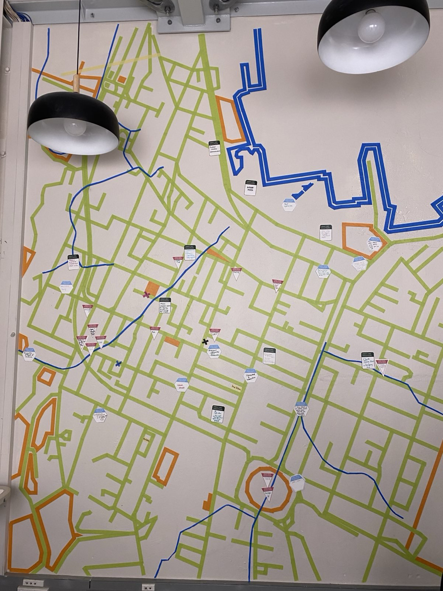
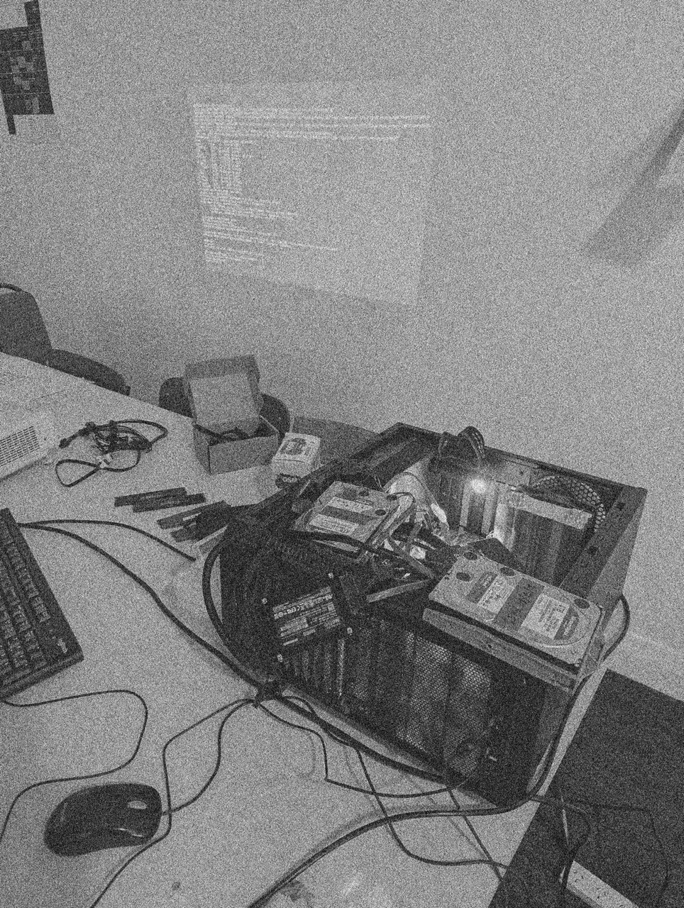
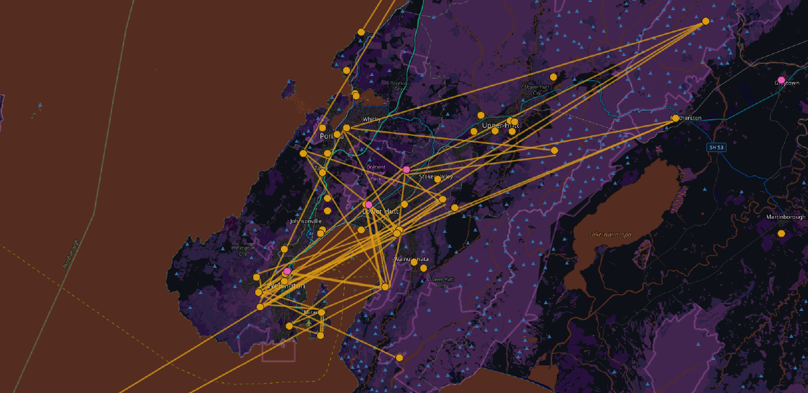

> [Critical Signals](criticalsignals.nz) explores practical and visionary responses to an
> era of collapses, with a focus on kai sovereignty, data
> sovereignty, collective resilience, and adaptation strategies
> under a rapidly changing climate. With community at the project
> center, it asks what changes could we make to our infrastructure,
> food and energy systems to ensure we not just survive, but thrive,
> in the years ahead.

This evolved from last years successful [Beautiful
Signals](/p/beautiful-signals). A 3 months long community space
hosted in Pōneke / Wellington in partnership with the Goethe
Institute, several universities, and many community memebers.

I built and maintained the [website](criticalsignals.nz) in collaboration with infrastructure by [nikau.io](https://nikau.io/).

