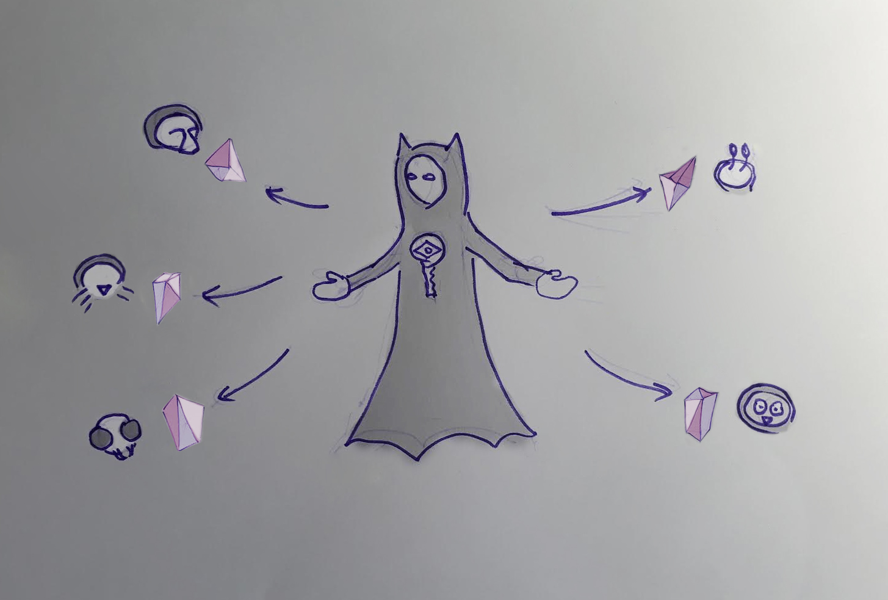
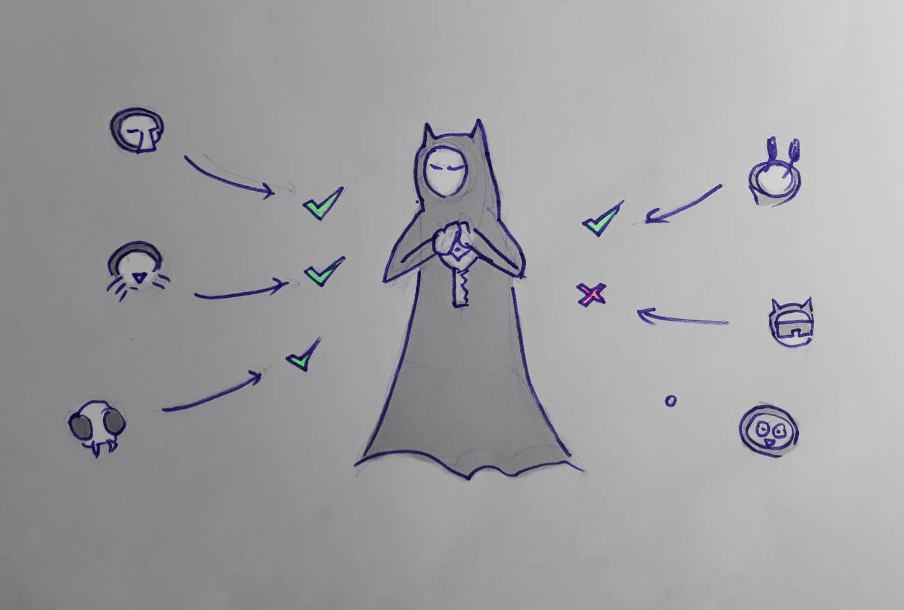
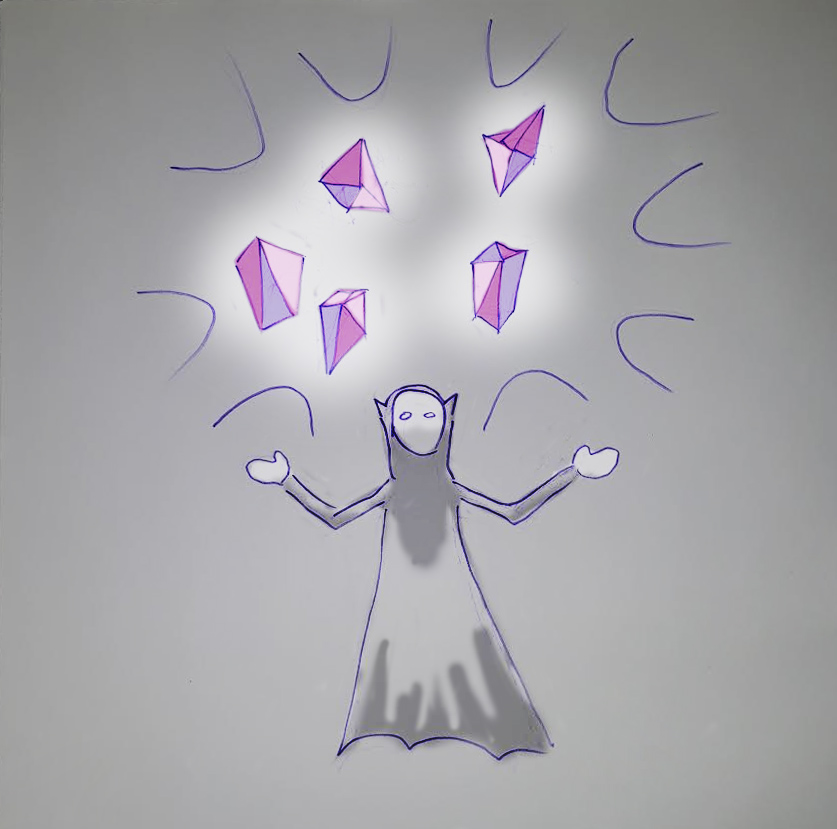
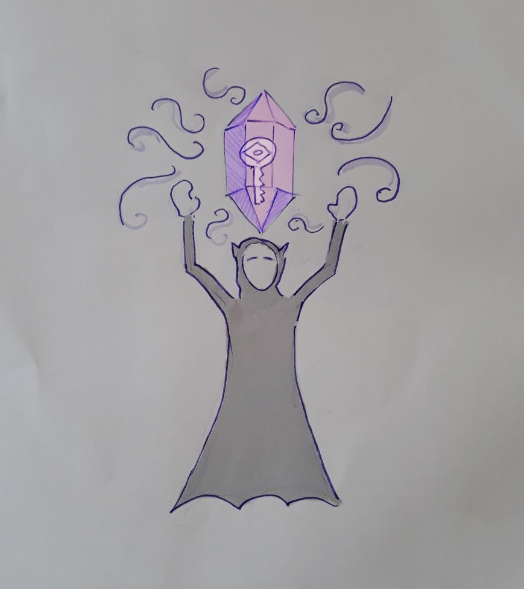
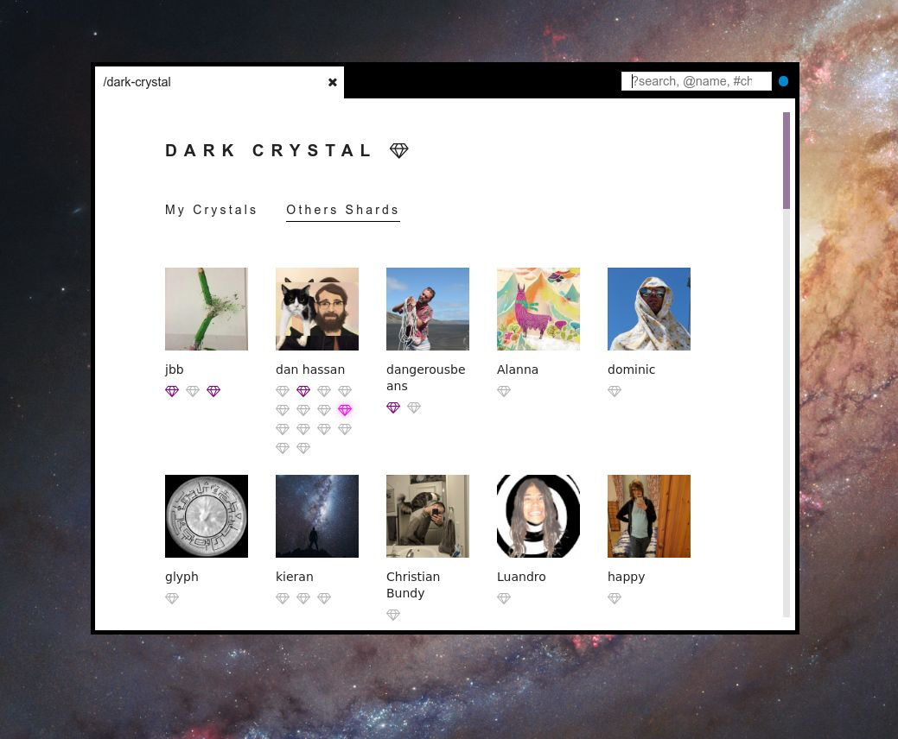

## About

Some friends and I were exploring blockers to cryptocurrency being accessible
and identified that "recovery" (of secrets) was perhaps the number 1 challenge.

In 2017 I'd messed around with [Shamir's secret sharing](https://en.wikipedia.org/wiki/Shamir%27s_secret_sharing), and we noticed that we could use this concept in concert with a social network in order to safely store backups. Here's some art I made describing the process:

We designed a protocol, wrote a specification, and implemented a prototype in Scuttlebutt (a social p2p/ local-first social network).

We presented our work at [DevCon 4](https://www.youtube.com/watch?v=pOloj658DtQ)
and this led to grants from the Ethereum Foundation, further iterations on
protocol, user-research, partnership with Briar, a java implementation and more.

## Technical

| Library | Description |
|---|---|
| [scuttle-dark-crystal](https://github.com/blockades/scuttle-dark-crystal) | Raw function for running Dark Crystal over Scuttlebutt |
| [patchbay-dard-crystal](https://github.com/blockades/patchbay-dark-crystal) | plugin for [Patchbay](/p/patchbay) (a Scuttlebutt client) |

