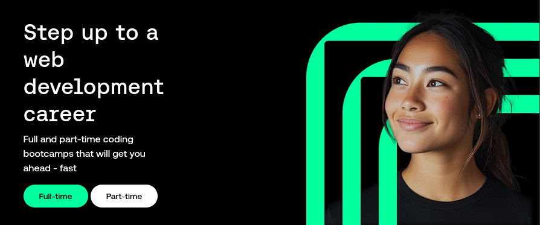
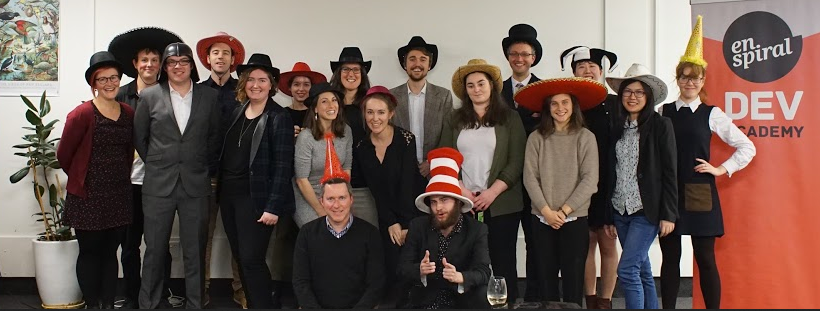

> ⏳ 2015 -- 2017  

My experience of the potential of what education *can* be through working at 
[Unlimited](/p/unlimited) radicalised me to the point where I didn't think I
would ever work in an educational institution again.

## Precursor

After leaving teaching for the first time, I went to art school, and happened to
come into contact with some nerds also hacking on community in a different way
([Enspiral](https://www.enspiral.com)). As a summer experiment, Josh Vial
mentored a group of people in how to code. (This may have been the _alpha_
cohort foreshadowing Dev Academy.)

I left art school, joined [Loomio](/p/loomio), and extended my radical (i.e.
anarchist) teaching skills into the space of collective organising,
facilitation, and agile development. I did a range of contracts through a
collective called CraftWorks (also part of Enspiral). 

## Teaching Programming

Having validated an opportunity for a different sort of tertiary eduction around
programming, Josh Vial and Rohan Wakefield launched Dev Academy. The format was
something like a remote prep course, follow by a 9-week long in person
intensive course.

I was invited to do mentoring for the early cohorts, and ultimately moved into
full time teaching. The teaching team in our era ran somewhat autonomously - we
created and evolved curriculum, hired our own staff, and coordinated with the
rest of the organisation.

"Teaching" at Dev Academy was similar and different to Unlimited. Everyone on
the course had explicitly chosen and opted in to this very specific pathway.
It was incredibly intense - the amount of ground we covered over 9 weeks was...
quite like being thrown in the deep end, relentless. However we coupled the
technicalities of the conceptual code learning with an strong structure of
personal support - teaching personal reflection, interpersonal communication
tools, and providing close mentoring and counselling.

So... once again seeing the humans holistically, treating learning as a deeply
personal journey (not just an exercise in content) - of relationship with
yourself and with others.

## Legacy

It was at Dev Academy that I met Piet Geursen. We formed and enduring
relationship through teaching and leading together, and went on to found
a cooperative together - [Protozoa](/p/protozoa).

I supported several friends into careers programming through Dev Academy.
Some of them are now coop members too! [Āhau](/p/ahau) + [Mātou's](/p/matou) 
are also projects that were founded by several Dev Academy graduates.

