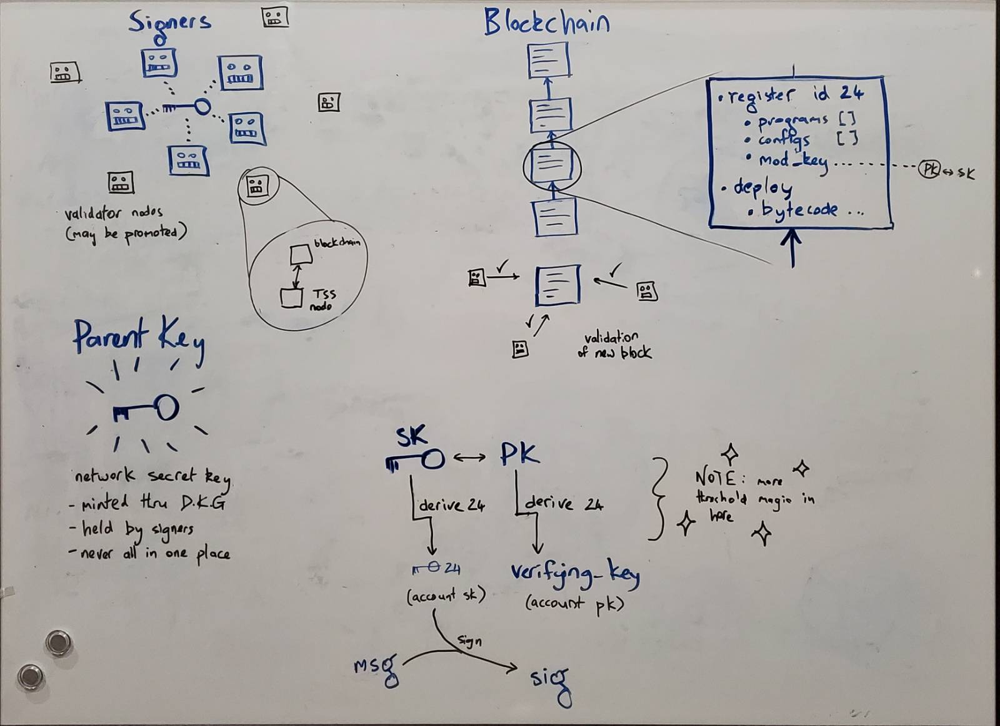

> ⏳ 2024 -- 2025  

## About

Entropy has been a few things over it's lifetime. At the time I worked on it it
was a distributed signing service, which would form foundational infrastructure
for many automated processes. In essence a new sort of coordination and
financial tooling.

The core proposition was
- users can set up "accounts" which have configuration held on a global
  blockchain. This includes
    - who may initiate signatures for this account?
    - what data are they allowed to sign (e.g. raw binary? Transactions < 0.5 ETH?)
- any user may request a signature on some data, and if the user + data pass
  validation, then the network initiates distributed threshold signing, and a
  signature is returned.

## Relationship

I met Entropy through a [coop](/p/protozoa) member who had been working with
them for more than a year. Turns out there were a bunch of p2p friends also
working there -- 2 from [Dark Crystal](/p/dark-crystal), 1 from
[Scuttlebutt](/p/scuttlebutt).

It was great to work in a social aligned and well resourced team. Bunch of kinda
crazy and very talented humans. I particularly valued the leadership of
Frankiebee - my direct team lead.

## Leadership

- team lead for the JS CLI
- leading architecture changes
- hosting cross-team Schema specification
- retrospectives for the JS team
- helping structure an offsite

## Technical

The libraries I helped develop:

| Library | Description |
|---|---|
| [@entropyxyz/cli](https://www.npmjs.com/package/@entropyxyz/cli) | A CLI tool which supports programmatic and TUI interactions. The most accessible entry point for developers using Entroypy. I was the lead dev on this |
| [@entropyxyz/sdk](https://www.npmjs.com/package/@entropyxyz/sdk) | Low level NodeJS library. I was a lead reviewer and contributed to design. |

Within Entropy I was also responsible for
- dramatically improving testing
    - building CLI testing
    - slashing the run time of CI test pipelines
    - adding logging
- a major refactor of the CLI

