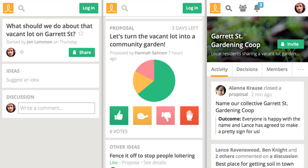
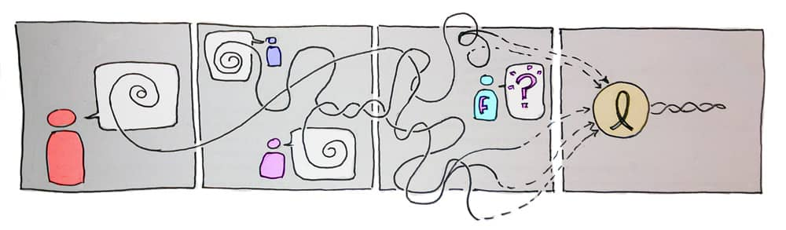

## About

Loomio was a project born out of the Occupy Wallstreet movement meeting
[Enspiral](www.enspiral.com). It's a open source tool which supports
decision making - specifically timely, iterative, consensus/consent building
process, with a focus on clearly stated (and archival) records of results.

Read about all the places this tool has been used on the [blog](https://www.loomio.com/blog)

## Relationship

I was a member-owner of the cooperative that formed around building this, a
programmer, a coordinator of translation, a
[scrum-master](https://www.loomio.com/blog/2013/10/30/our-people-scrum-master-mix/).

This was my first major FOSS (Open Source) project, my friend cooperative experience.
I was transformed forever by the commitment to values aligned technology, investment, ownership,
group processes.

This project brought me into contact with collectives in New Zealand, and
around the world. I also worked with activists who volunteered translating
Loomio into their native languages -- people working to grow collective power,
support better discourse, bolster democracy.

**Tech I worked with**: Ruby on Rails, Javascript, NodeJS, i18n, and Amazon S3.

