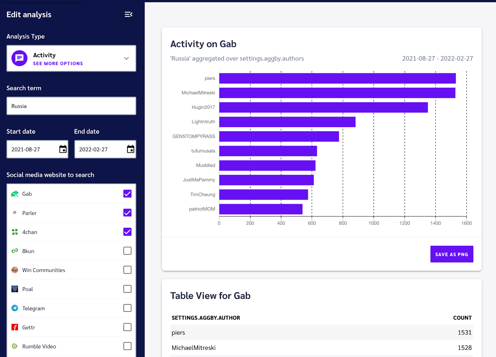
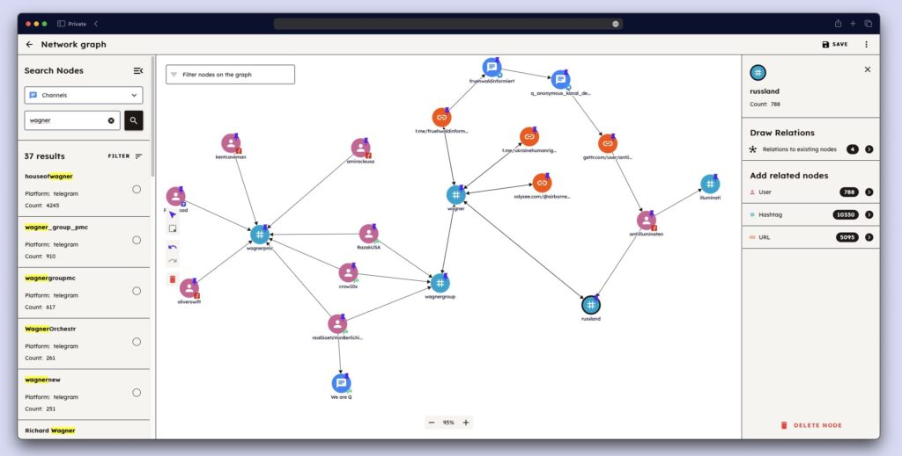
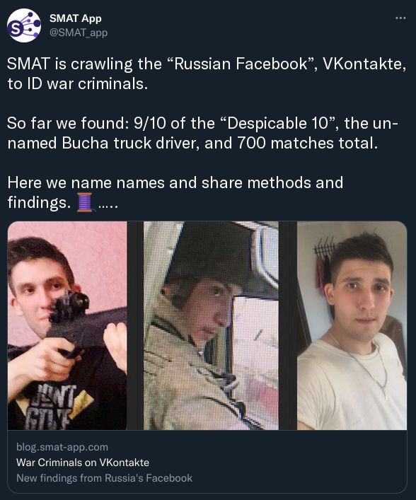
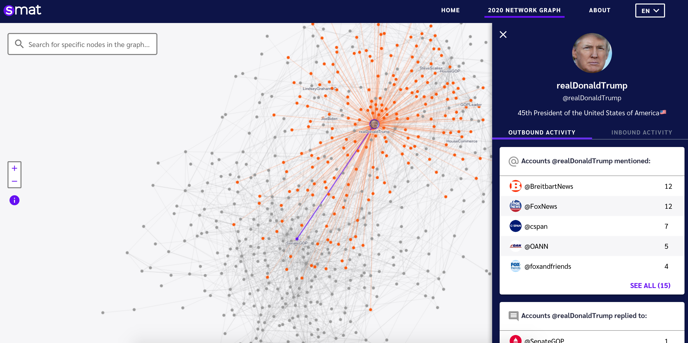

> ⏳ 2020 + 2022

## About

Open Measures (fka SMAT) is a project which archives social media data, and
makes that data explorable via APIs or data visualisations.

It was designed to support journalists and academics do things like research
the spread of misinformation, identify war criminals, and explore patterns in
discourse.

:link: [War Criminals on VKontakte](https://blog.openmeasures.io/p/vk-war-criminals)

## Relationship

I've worked with Open Measures a couple of times over the years. I helped design
their GraphQL API, and was responsible for implementing a graph visualisation
tool to explore politician's social media interactions leading up to the 2020
USA elections ([read more here](https://foundation.mozilla.org/en/blog/fellow-introducing-us-election-twitter-network-graph-tool))

I also mentored + trained junior developers working on the project, and later
worked on a more complete version of the graph tool.

**Tech I used**: Vue.js, Pinia, GraphQL, D3

