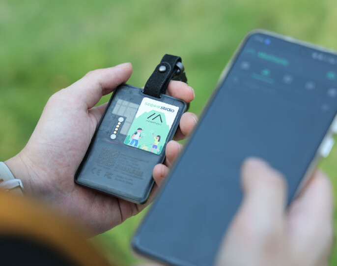
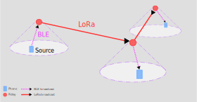

## Why?

In an earthquake, one of your primary needs is to be able to coordinate with 
those you love. _Are you ok? Where are you? Do you have the kids?_

The cellular network is great, but relies on a functional electrical grid, fibre
network. Any remaining towers may be overwhelmed (everyone panics and calls)...
ideally they are serving people buried under buildings. So we need something
else

## Mesh Networks

A low-cost, accessible solution is we run our own mesh network. A mesh network
is made up of many devices, each of which can talk to it's neighbour. This means
that someone in Miramar can write a message, which is thrown to peer in
Kilbernie, then Mount Vic, ... and on to it's destination in Upper Hutt.

The more devices there are in a mesh network, the more resilient it becomes.kk

Cell phones alone can't do this, but there are consumer-grade Bluetooth devices
which effectively let us do this for $67 NZD.

A mesh network is one made up of many devices, and messages are passed from
one to another, traversing the mesh.

There are now consumer-grade devices which let us turn our cell-phones
into devices which can communicate over longer distances, using an ad-hoc
(pop-up) mesh network.

This solution is each own a small device, which connects to your phone, and can
throw messages many kilometers using low-powered, long-range radio
([LoRa](https://en.wikipedia.org/wiki/LoRa)).

In a swarm, these devi 

A mesh network is made up of a bunch of peers talking who can talk to each
other, passing messages to their neigbours to get messages to travel further.

is one which is made up of a bunch of peers/ nodes which talk to each other, and
pass messages to one another.

