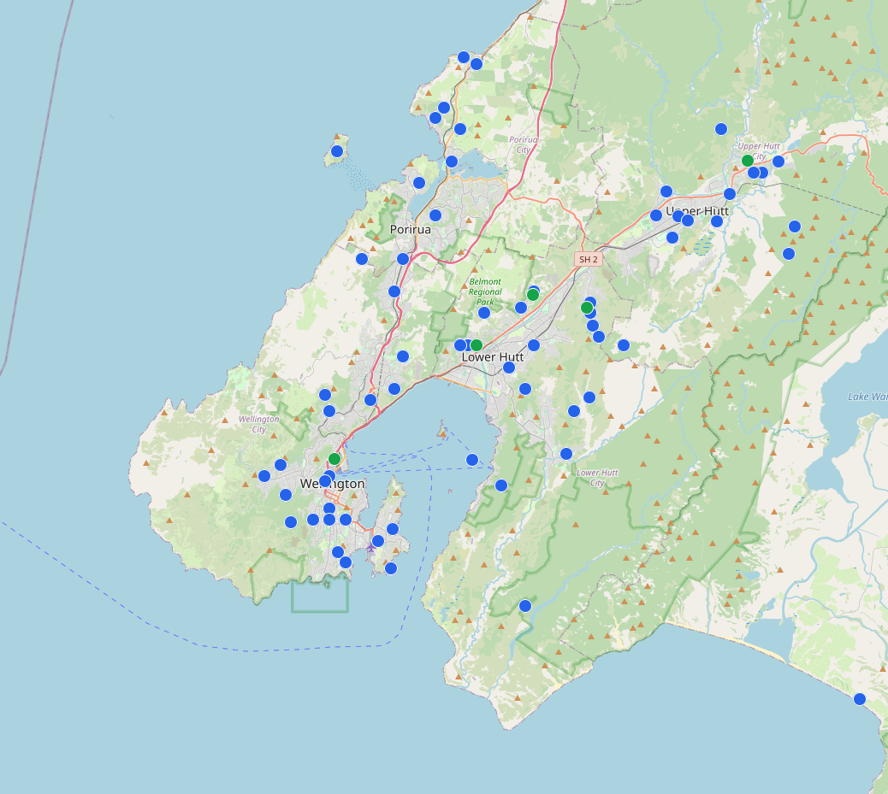

In an earthquake, you need to coordinate with those you love.

  

    
 Are you ok? 

  

  
 
    
 Where are you? 

  

  

    
 Do you have the kids? 

    
23m

  

The cellular network is great, AND you should expect it to be disrupted. Cell
towers require a lot of power, and intact data/phone lines. If one goes down,
others take on more load, and when everyone is over-loading networks trying
to connect, they're even less reliable. 

So... what do we do?

## Mesh Networks

A mesh network is made up of many devices, each of which can talk to it's
neighbour. In a mesh network you can get a message across the city by passing
it through a series of peers. The good news is there's already an active mesh
in Wellington, and joining it will only make communication more resilient.

_Images taken from this [Live Map](https://meshtastic.liamcottle.net/?lat=-41.24651893516453&lng=174.869384765625&zoom=11), May 2025._

Some interesting things to note about this mesh network
- **what a mess!** -- correct, this is mostly an uncoordinated (ad-hoc)
network. It evolves over time as nodes move, turn on/ off. Messages just take
the paths that are open and it mostly "just works".
- **how come some line are real long?** -- some devices are on top of mountains,
and/ or have special antennas, which means signals can jump further (like the
top of the South Island).
- **isn't revealing your location a security risk** -- Yes! Not all devices opt
into broadcasting their position, i.e. there are likely more devices in the mesh
that pictured. I believe you can also choose to have a "rough" location
broadcast so people others can map your neighbourhood, but not your (latitude,
longitude)

## Beginners Recipe

Cell phones don't currently have LoRa (long range radio) capability built in,
but we can easily add that functionality via a Bluetooth accessory.

<figure>
  

  <figcaption>
  Two phones message via LoRa devices they are each connected to.
  </figcaption>
</figure>

This recipe gives you **text messaging** + GPS location over a mesh network.
The battery on the LoRa device should last a couple days, and not take much to
charge.

### Ingredients

I recommend you buy parts for you and a friend - you immediately have someone
you can communicate with AND you further strengthen the mesh for the wider
community 

| Hardware | Function | Cost |
|---|---|---|
| Smart phone | _screen + keyboard_ | BYO |
| [SenseCAP T1000e](https://www.seeedstudio.com/SenseCAP-Card-Tracker-T1000-E-for-Meshtastic-p-5913.html) | _LoRa radio_ |  $40 USD + shipping | 

The T1000e is the device my community is recommending. I've played with one for
a morning and was **very** impressed -- it works out of the box, required only a
little setup, and there was no command-line hacking. You connect to it via
Bluetooth and it takes care of all the LoRa stuff.

NOTE: you need 1 x T1000e per person

| Software | Function |
|---|--|
| [Meshtastic App](https://meshtastic.org/downloads/) | _messaging app + device config_ |

Meshtastic is an open-source project with builds mesh-networks via LoRa devices.
It's been designed to work with a range of devices, and lets you configure them
via Bluetooth. It is also the main interface by which you message other peers in
the network - there is functionality for public messages, private group chat
(encrypted), and direct messages (encrypted)

### Steps

For detailed guides see:
- :link: [Official T1000e docs](https://wiki.seeedstudio.com/sensecap_t1000_e/)
- :link: [Meshtastic config](https://meshtastic.org/docs/getting-started/initial-config/)

Rough overview you can probably get away with:
1. Install Meshtastic from an app-store
2. Unbox and power on your T1000e
3. Bluetooth pair your phone + T1000e (default pin: `123456`)
4. Open Meshtastic and configure your T1000e to `ANZ` radio spectrum
5. _push all the buttons_...

## FAQ

**Q: Can I do voice/ video calls?**  
A: No. This is optimised to be very low-energy comms, so does not support
high-bandwidth needed for live voice / video

**Q: Can multiple phones connect to a T1000e?**
A: I'm not sure. Be aware that as it's currently built your "identity" if bound
to your T1000e (not your phone), meaning if 2 phones are connected, they will
both be see to other mesh nodes as the same author.

---

## Advanced

:construction: Under construction

