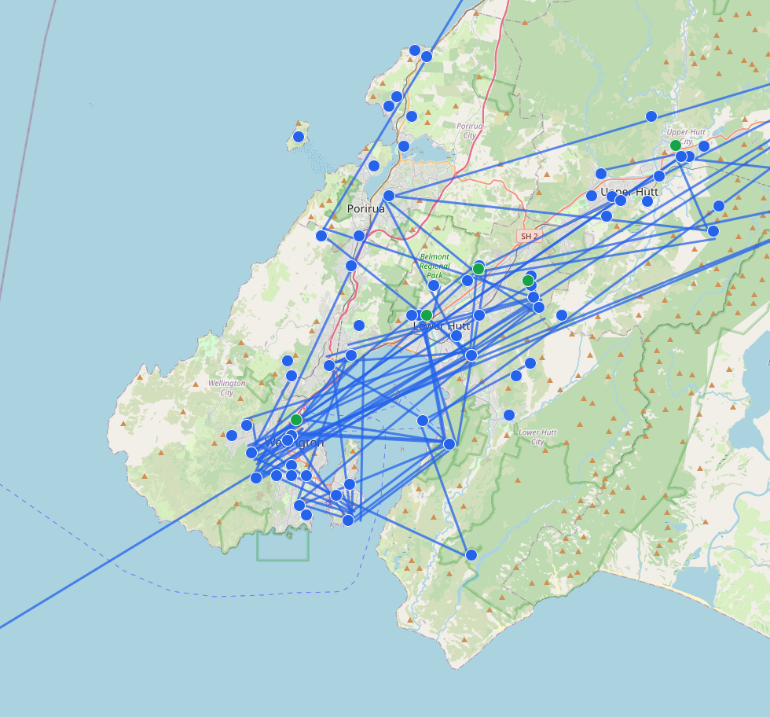
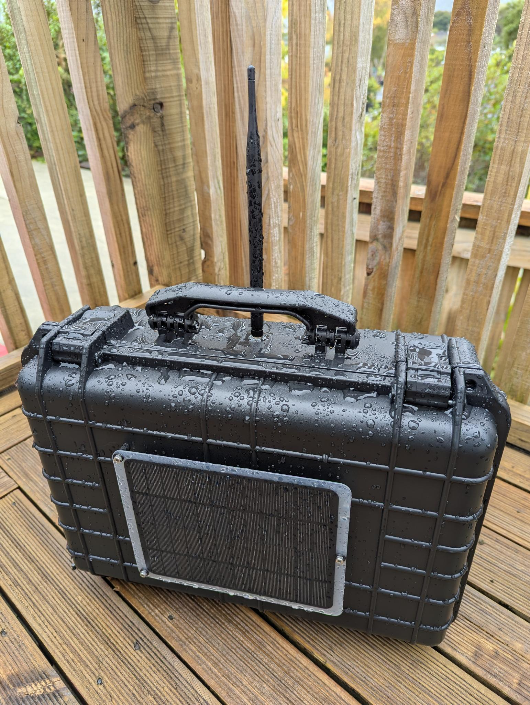

In an earthquake, you need to coordinate with those you love.

  

    
 Are you ok? 

  

  
 
    
 Where are you? 

  

  

    
 Do you have the kids? 

    
23m

  

The cellular network is great, AND you should expect it to be disrupted. Cell
towers require a lot of power, and intact data/phone lines. If one goes down,
others take on more load, and when everyone is over-loading networks trying
to connect, they're even less reliable. 

So... what do we do?

## Mesh Networks

A mesh network is made up of many devices, each of which can talk to it's
neighbour. In a mesh network you can get a message across the city by passing
it through a series of peers. The good news is there's already an active mesh
in Wellington, and joining it will only make communication more resilient.

_Images taken from this [Live Map](https://meshtastic.liamcottle.net/?lat=-41.24651893516453&lng=174.869384765625&zoom=11), May 2025._

Some interesting things to note about this mesh network
- **what a mess!** -- correct, this is mostly an uncoordinated (ad-hoc)
network. It evolves over time as nodes move, turn on/ off. Messages just take
the paths that are open and it mostly "just works".
- **how come some line are real long?** -- some devices are on top of mountains,
and/ or have special antennas, which means signals can jump further (like the
top of the South Island).
- **isn't revealing your location a security risk** -- Yes! Not all devices opt
into broadcasting their position, i.e. there are likely more devices in the mesh
that pictured. I believe you can also choose to have a "rough" location
broadcast so people others can map your neighbourhood, but not your (latitude,
longitude)

## Beginners Recipe

Cell phones don't currently have LoRa (long range radio) capability built in,
but we can easily add that functionality via a Bluetooth accessory.

<figure>
  

  <figcaption>
  Two phones message via LoRa devices they are each connected to.
  </figcaption>
</figure>

This recipe gives you **text messaging** + GPS location over a mesh network.
The battery on the LoRa device should last a couple days, and not take much to
charge.

### Ingredients

I recommend you buy parts for you and a friend - you immediately have someone
you can communicate with AND you further strengthen the mesh for the wider
community 

| Hardware | Function | Cost |
|---|---|---|
| Smart phone | _screen + keyboard_ | BYO |
| [SenseCAP T1000e](https://www.seeedstudio.com/SenseCAP-Card-Tracker-T1000-E-for-Meshtastic-p-5913.html) | _LoRa radio_ |  $40 USD + shipping | 

The T1000e is the device I'm recommending. It works out of the box, requires
only a little setup, and there was no command-line hacking. You connect to it
via Bluetooth and it takes care of all the LoRa stuff.

NOTE: you need 1 x T1000e per person

| Software | Function |
|---|--|
| [Meshtastic App](https://meshtastic.org/downloads/) | _messaging app + device config_ |

Meshtastic is an open-source project with builds mesh-networks via LoRa devices.
It's been designed to work with a range of devices, and lets you configure them
via Bluetooth. It is also the main interface by which you message other peers in
the network - there is functionality for public messages, private group chat
(encrypted), and direct messages (encrypted)

### Setup

1. Install Meshtastic from an app-store
2. Power on your T1000e
    - push the center of the raised circle → :musical_note:
3. Pair your phone
    - turn on Bluetooth
    - open the Meshtastic App
    - go to Config :gear: tab (far-right)
    - push the **(+)** at bottom-right
    - select your device, use default PIN `123456`
4. Set the spectrum
    - go to the Config :gear: tab
    - open the "Region" dropdown, and pick `ANZ`
    - the device will restart → :musical_note:
5. Get channel config from a friend
    - Wellington uses public channel "ShortFast"

### Setup -- optional extras

  
Set your name

  1. Push the vertical ellipsis **⋮** (top-right)
  2. Select "Radio Config"
  3. Open "User >"
  4. Set your name
      - Long name: publicly visible name
      - Short name: publicly visible name, limited to 4 characters
  5. Push "Send"
      - wait for device to restart → :musical_note:

  :warning: use a name other than your full legal name. Recommended because the device
  by default reveals your approximate position (within 100m)

  
Turn off that beep!

  When you receive a new message, the default behaviour of the Sensecap is
  for it to beep repeatedly. You can dismiss that beeping by pushing the power
  button on the Sensecap once.

  If dislike beeps (and are happy with just notifications on your phone):

  1. Push the vertical ellipsis **⋮** (top-right)
  2. Select "Radio Config"
  3. Open "External Notification >"
  4. Toggle "External notification enabled" to "off"
  5. Push "Send"
      - wait for device to restart → :musical_note:

  
Change your Position settings

  By default this device broadcasts your approximate position (within 100m).
  You can change this up or down depending on your context (safety/ privacy).

  1. Push the vertical ellipsis **⋮** (top-right)
  2. Select "Radio Config"
  3. Open "Position >"
  4. Change "Smart broadcast minimum distance (meters)"
      - the default is 100
  5. Push "Send"
      - wait for device to restart → :musical_note:

## Important Info

**Message delivery is not guaranteed.** There are several ways a message may not
make it to the person you want it to:

1. Your device is not in range of any other
   - e.g. you are alone in an isolated valley
   - e.g. there are heaps of buildings blocking you in
2. There is no pathway from you to your friend
   - your message makes it to another device, is passed on, ... but doesn't
make it as far as your intended recipient

Missing messages is a side-effect of Meshtastics approach to replicating data.
Not all mesh systems have this problem, and this is a space that is being
[actively researched](/p/tiny-ssb).

The design of Meshtastic does let you see **some** information about delivery:

### Direct Message Delivery

In the case of direct messages, there are 4 symbols you see
- **sending** -- a cloud :cloud:
- **picked up by mesh** -- a cloud :cloud: + :heavy_check_mark:
- **delivery confirmed** -- a person :bust_in_silhouette: + :heavy_check_mark:
- **error?** -- a cloud :cloud: with a line through it

### Group Chat Delivery

In group chats it is much less clear. You may get some confirmation of delivery,
but I would only trust this to mean it was acknowledged by *some member* of that
group.

You should discuss with your community what your protocol is for adapting to
this. A simple one would be to put thumbs-up on messages that have been
received.

## Documentation

- :link: [Official T1000e docs](https://wiki.seeedstudio.com/sensecap_t1000_e/)
- :link: [Meshtastic config](https://meshtastic.org/docs/getting-started/initial-config/)

## FAQ

**Q: Can I do voice/ video calls?**  
A: No. This is optimised to be very low-energy comms, so does not support
high-bandwidth needed for live voice / video

**Q: Can multiple phones connect to a T1000e?**
A: I'm not sure. Be aware that as it's currently built your "identity" if bound
to your T1000e (not your phone), meaning if 2 phones are connected, they will
both be see to other mesh nodes as the same author.

---

## Advanced

:construction: Under construction

