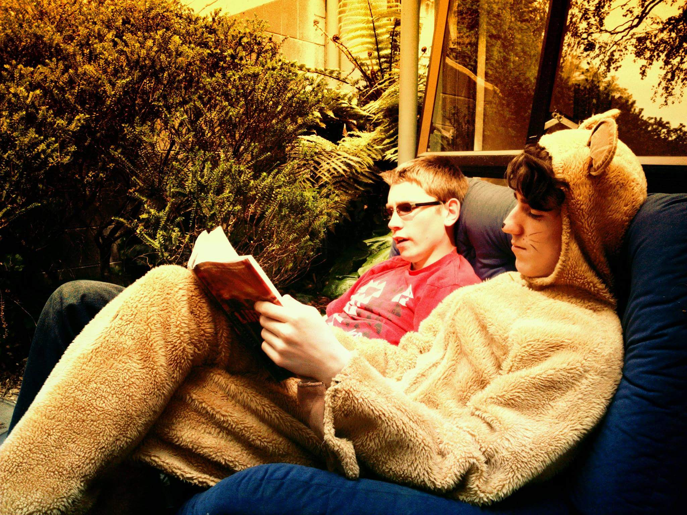
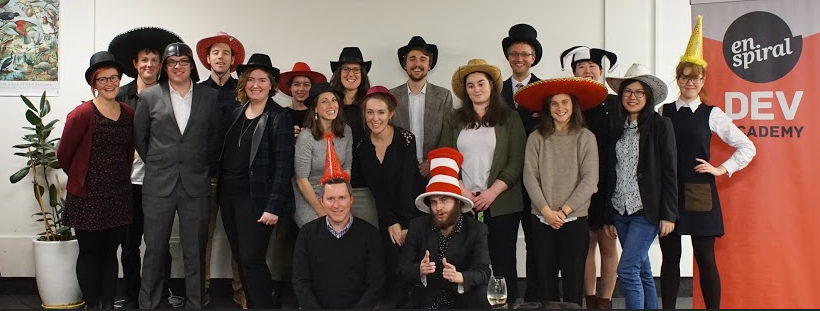

I value conciseness so here's what I think the essence of it is:

```
    Power dynamics hamper learning
    What a waste of potential
```

## My History

_There's a chance I'm wrong. Here's my story if you want to parse it yourself._

### School

As an inquisitive (and naive) teenager, I judged IT largely by what was offered at school.
Touch typing, some HTML maybe, but none of the really beautiful stuff.
The offering was boring and unchallenging compared to centuries-old maths and sciences. 


### University

My inquiry led me to study neuroscience, which turned out to be a bit too
reductionist to practically help me understand people (so western!). I graduated
as a mathematician, and after failing as a post-graduate research assistant
(modelling blood splatter of blunt weapon trauma), I took a government subsidy
to train as a teacher.

I'd really enjoyed tutoring at university, but found that my higher education on
education guided me into surprisingly unsavoury amounts of acting (playing some
authoritarian role) and crowd control (learning tricks to manipulate group
social dynamics to maintain control).

I didn't care about the length of hair or the height of socks. Quiet (but
noticed) protest looked like attending careers day and meeting prospective
school principals in ripped jeans. I didn't bother attending my graduation (NOTE
- going off piste often requires more paperwork later).

The irony of teaching engaging learning in a lecture format was a laugh, but the
university did introduce me to [Ao Tawhiti Unlimited Discovery](/p/unlimited) -
the only high school I would take a job at. This wasn't an act of rebelion, more
an extension of my stubornness and pickiness (which I was rich enough to be able
to afford).

What was so attractive about Unlimited was the atmosphere (or people dynamics).


### Radical Education



[Unlimited](/p/unlimited) is a state funded public secondary school that exists
because of a loophole in the law, which allowed the bending of a rule meant for
the integration of church schools into a rule which allowed the school to write
its own assessment rules. Its "special character" is "a fundamental tenet that
the child is central in directing his or her own learning so that the enthusiasm
and love of learning is retained." My kind of place.

I can talk a lot about what made that environment transformative, but I think
the key was radically more equal power dynamics. As a Learning Advisor there, I
didn't assert authority through enforcing arbitrary rules. I had conversations
on a first name-basis with people about what they cared about in life. Classes
didn't have age-barriers, and students could choose what they wanted to do every
5 weeks. Instead of segregation and age-based hierarchy, there was conversation
and experiementation.

It felt good. People were kind (not to be confused with nice), and they learnt a
lot. Instead of negotiating bullying and claustrophobia, students spent their
time doing things like attending university level classes, running New Zealand's
only OpenDNS server from a bedroom, and working together to support a friend
with depression. Some of the experiences moved me so deeply I still cry when I
recall them.

Most state education is missing the mark by a wide margin. It makes me
thoroughly sad - and angry.


### Art School

I loved Unlimited, and learnt an enourmous amount there, but I left to stretch
skills outside of teaching. There was also a massive earthquake that destroyed
the city. I moved to attend art school, where I got into programming the laser
cutter (which I was shocked to find almost no one else was using). 


in construction")

I was the worst adult student - I know what good education looks like, and I
like giving feedback. The context and tools were great but the educators
(outside of the pure theorists) were weak.

I left and did some relief teaching where I tried to treat students as equals. I
was horrified to discover that the acting I'd disliked in state teaching is a
two part play, and exiting a play is hard when the other actors are continually
asserting your role. Genuine conversation was overridden by a race to establish
dominance and control.


### Social Enterprise

Over a summer break I was introduced to Joshua Vial who taught me (and several
others) to be web developers. I took these skills and helped build Loomio (an
open source collaborative decision-making tool).

The people of [Loomio](http://www.loomio.org)  - and the garden-nebula Enspiral
within which it grew - were the next group of most excellent people I met. This
is where I was introduced more explicitly to a discourse around power.


### More Radical Education

I'm now a teacher at [Enspiral Dev Academy](http://www.devacademy.co.nz), a
coding bootcamp that trains non-technical people to become junior web developers
in 9 weeks. It's a synthesis of my interests to date - programming, learning,
and community building.

I take myself, and those around me to and beyond the limit of our technical
ability. The only way you can do that effectively and get anything out of it is
to be super up-front about what you do and don't understand.



## Power and Knowledge

Not knowing things for some reason brings up shame for people. The most
dangerous thing for a student is self-doubt, and sitting on shame is a good way
to get that. This is another topic I'm currently really interested in, and will
write more on some time.

I think that might be a study in itself, but I'm more interested in how _not
knowing_ plays out for teachers, because I believe this is the reason I'm not
currently an ascendant cyber-wizard.

When you don't know a thing as a teacher, a **very interesting** decision path
emerges: 

A) lie

B) admit you don't know


### Why would you lie?

Well, if your position as teacher is predicated on your knowing more, being the
_source of truth_, then not knowing might seem to undermine that.

The average high-school teacher is in a surprisingly precarious power-position -
it might look like they have control, but only through carefully guided consent
of the class.

For a teacher in a position where their authority is coupled to their knowledge,
it is awfully appealing to steer conversation away from topics which might erode
that position.

I think this is why classes on computers suck so bad in high school - they are
born of institution, which is established in such as a way as to bind teaching
to the bounds of individual mastery, which is finite.

Education around computers offer a unique window into the future of learning.
The field is moving so fast, that **the only reasonable path is to say "I don't
know"** a lot. If you don't, then talking about new and relevant ideas won't be
part of your curriculum.

In many educational institutions, saying I don't know is not safe for educators.
Generally they are in systems that give them positional authority to solve the
'behaviour management' problems. They are generally not afforded humanising
tools of social safety, like building genuine relationships, or sharing
vulnerability.

This does everyone trapped in that dynamic a huge disservice. Both teachers and
students achieve less understanding, less empathy, less collaboration, less
critical thinking, etc. The learning is poorer.

### Not knowing as Power

Being able to say "I don't know" is the beginning of some fantastic cascading effects:
- reveals 'students' and 'teachers' both as learners
- opportunity to model good learning
  - critical thinking/problem solving (process over rote learning)
  - asking for help
  - listening
- shows teacher as human, relatable
  - more trust, less lying
  - more humanistic dynamic, better conversations
- drop shame, move to a growth mindset
- go beyond boring 'safe' topics
  - interesting, inspiring
  - engaging (perhaps people like me 15 years ago)
- play


This is how I see power dynamics hampering our learning.

I'm investing in education systems which set aside positional authority, and
foster environments in which it's safe for everyone to be vulnerable. For older
systems, I'm building an evolving book format, designed to open education
resources and support teachers to transition from authorities to guides and
catalysts of learning.

I'm excited to be working in a community which is supporting me to develop a
different sort of learning pattern for myself. Maybe if we're lucky (and
persistent), we can shift learning patterns more broadly.

I would love to hear from anyone else playing the long game of reshaping
education.

