> ⏳ 2015 -- ongoing  

This is the project I have contributed the most to in my life. It's a p2p
replicating database, and a solarpunk community that grew up around and through
it. I've made life-long friends and built bridges spanning almost every
continent and honestly it's a challenge hard to summarize.

> :construction: Please feel free to direct queries to me about what you'd like
> to know more about

## Things I've done

Here's an incomplete summary of the many roles/ projects/ things I did:

- Hosted a Theory of Change workshop
- Lead development discourse from IRC to Scuttlebutt itself ([dogfooding](https://en.wikipedia.org/wiki/Eating_your_own_dog_food))
- Ran distributed strategy setting process
- Wrote many libraries + plugins
- Developed many applications on top of Scuttlebutt
    - [Āhau](/p/ahau)
    - Infinite Game
    - [Dark Crystal](/p/dark-crystal)
    - TikTak
    - Patchbay
- Co-designed new cryptographic primitives
- Created learning resources + documentation
- Ran an [international conference](https://one.camp.scuttlebutt.nz/)
- Ran grant process distributing ~$500K
- Administered Maintenance and Grant-writing funds
- Gave conference [talks](/categories/talks/)
- Designed an ran Faerie Rings - a peer support process

## Photos

### From things I was involved in

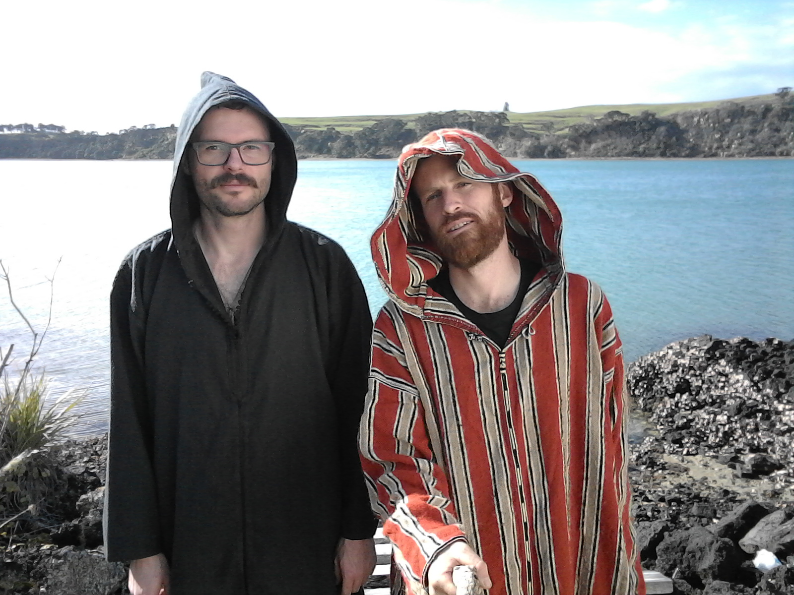
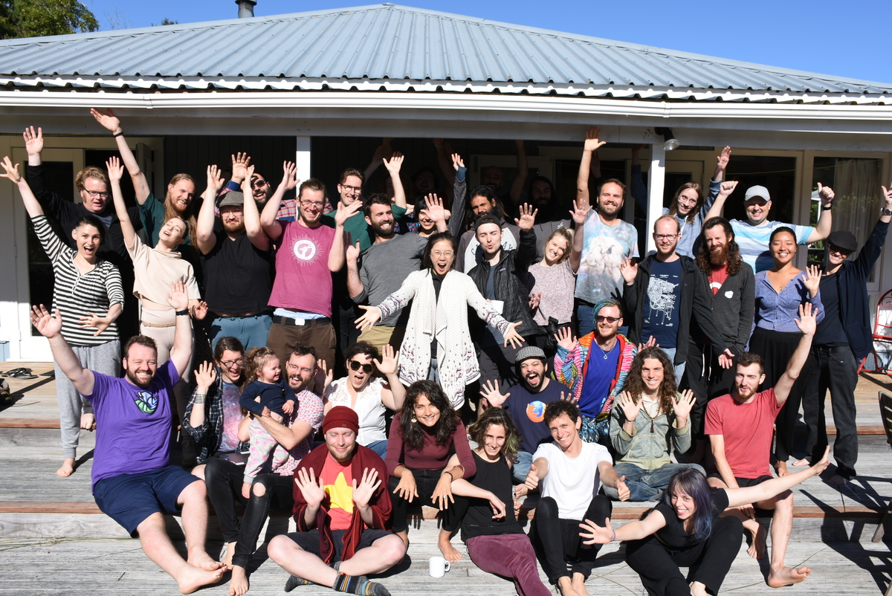

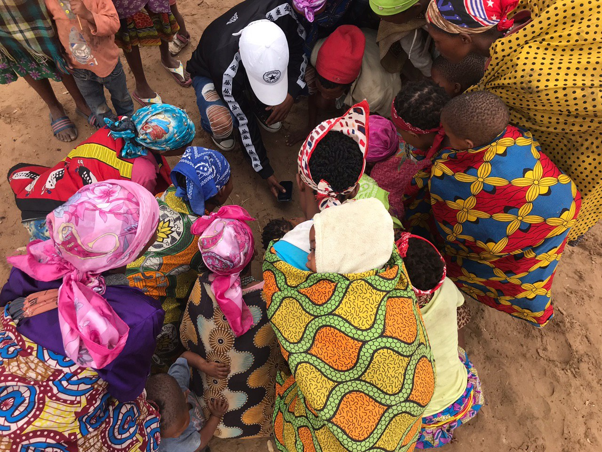
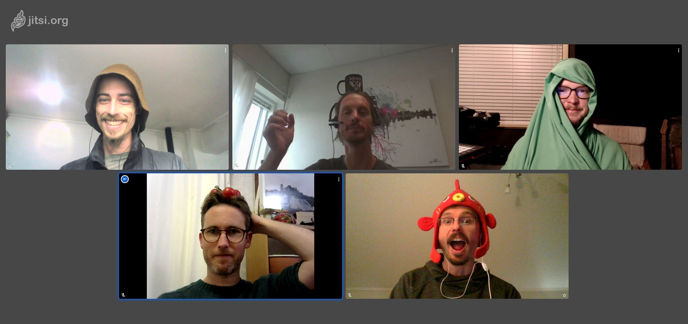

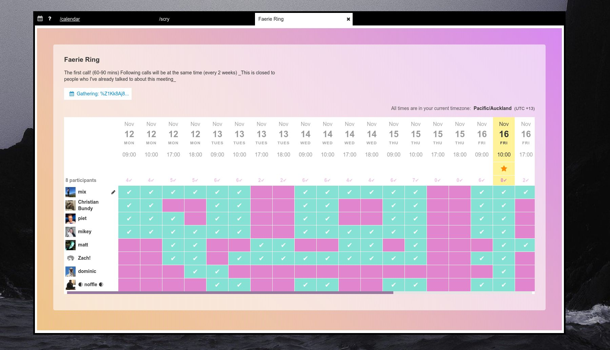
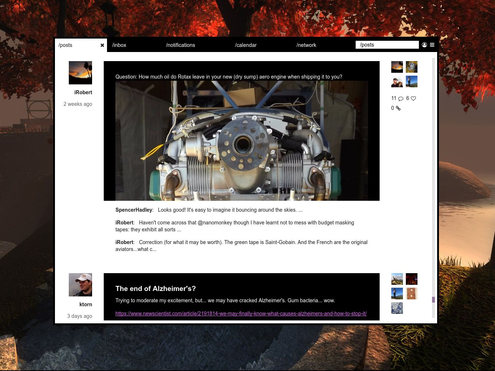

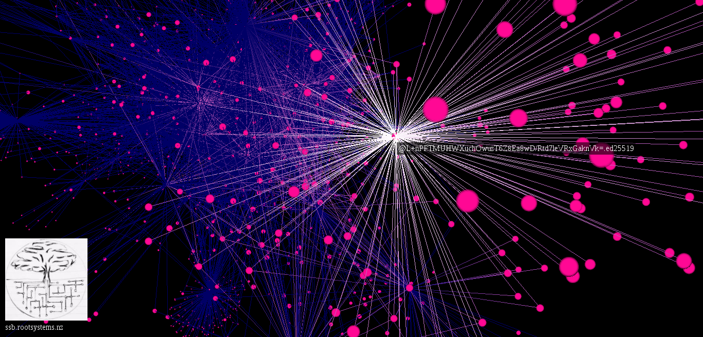

### From the Scuttleverse

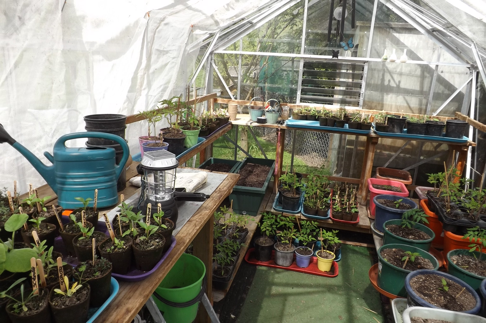
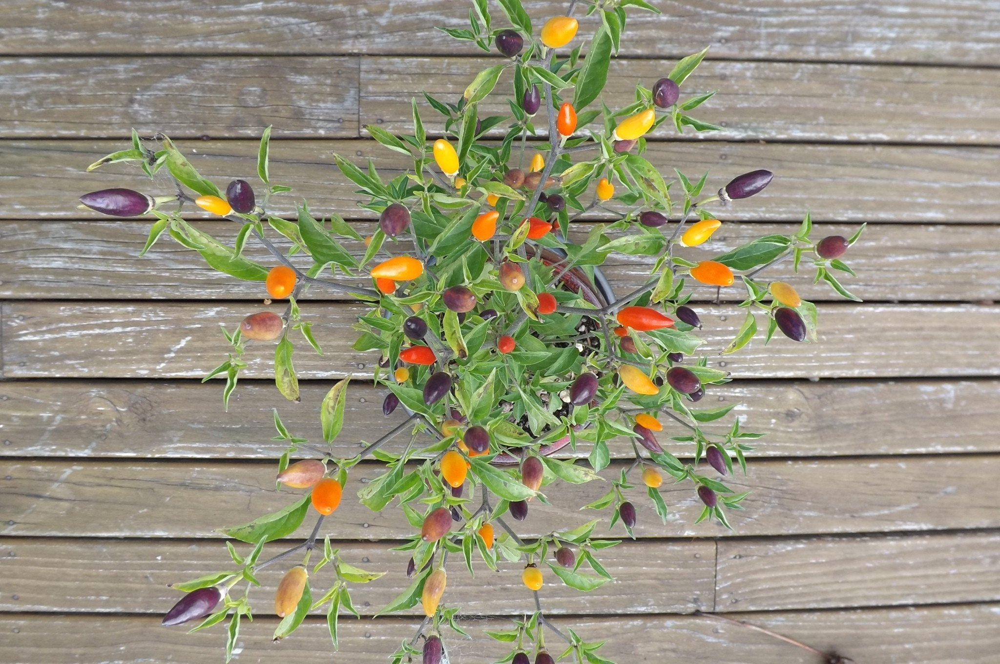

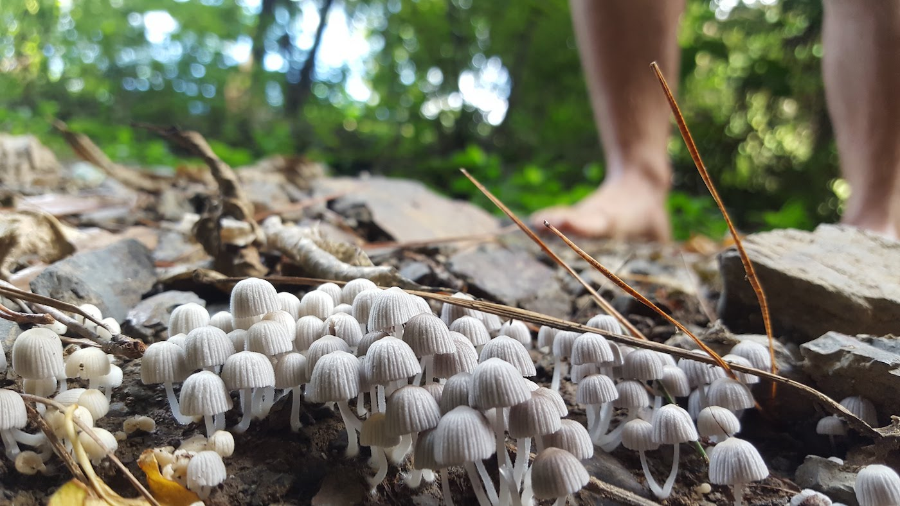
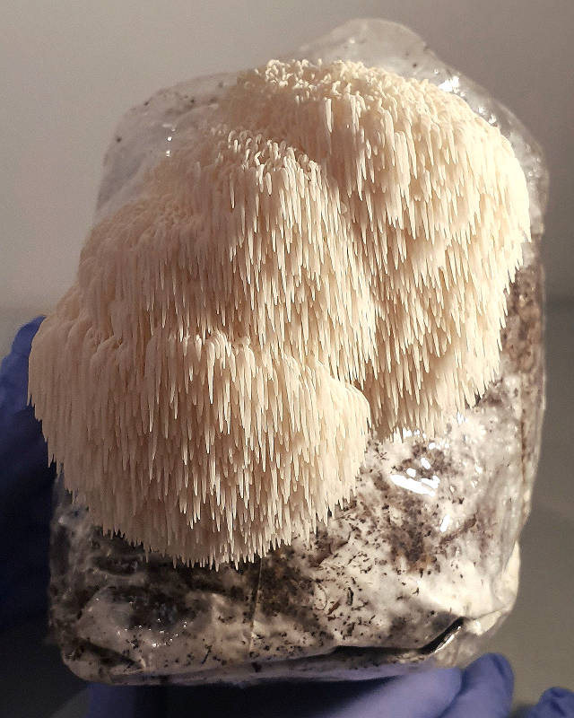

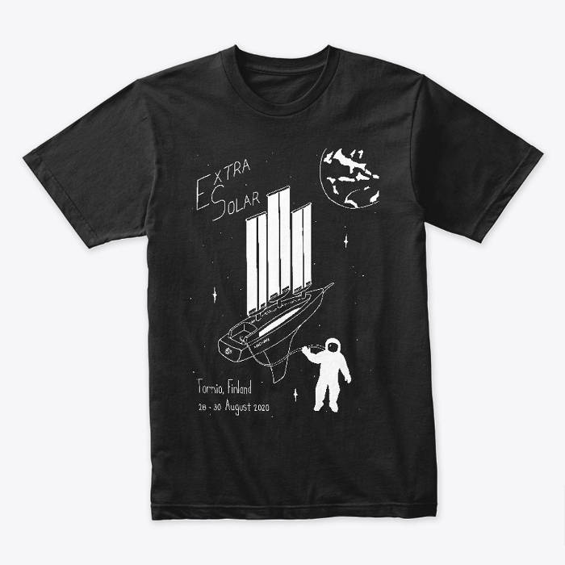
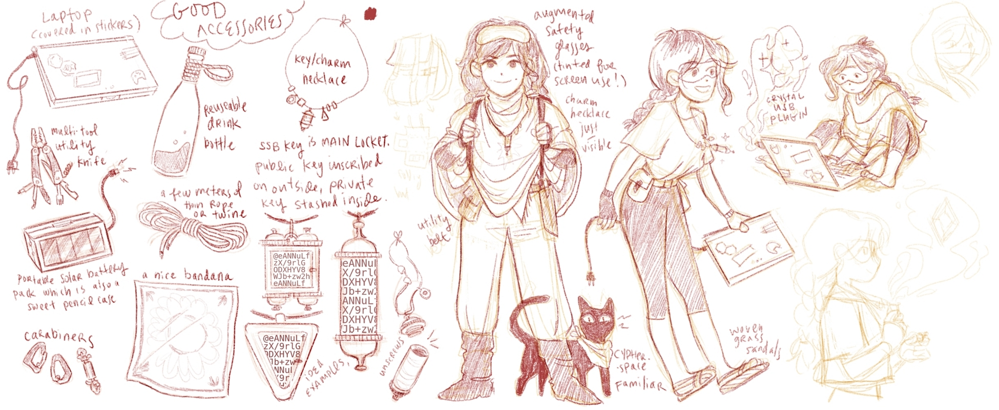

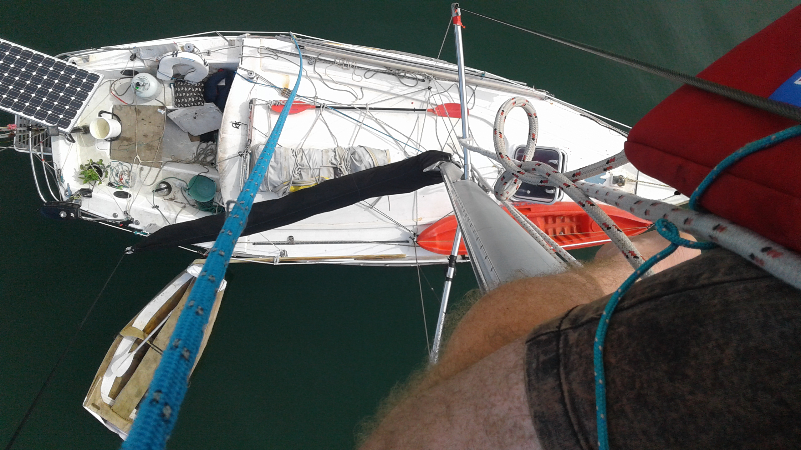

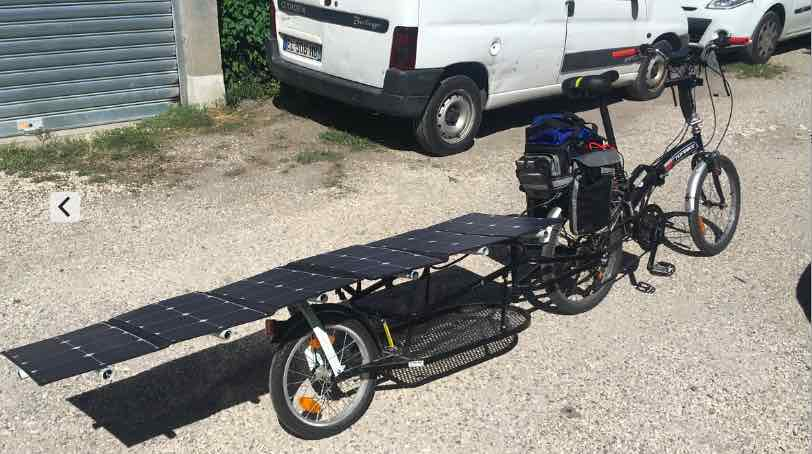
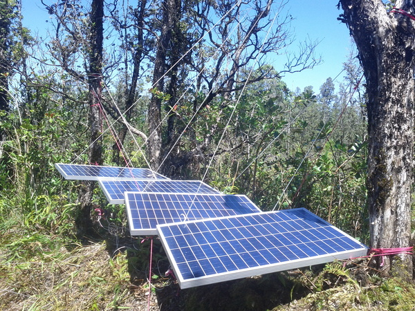

[See related posts](/tags/scuttlebutt)
