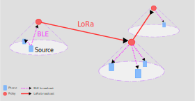
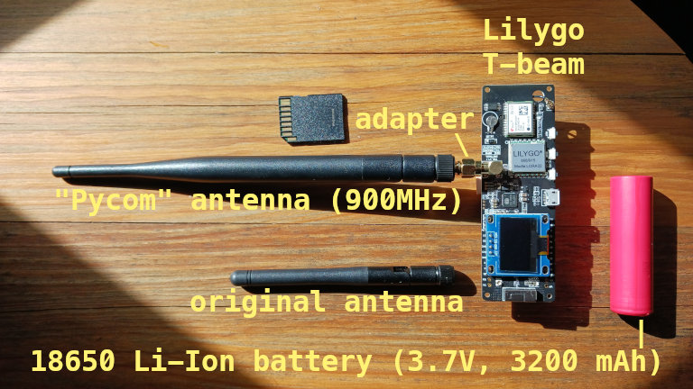
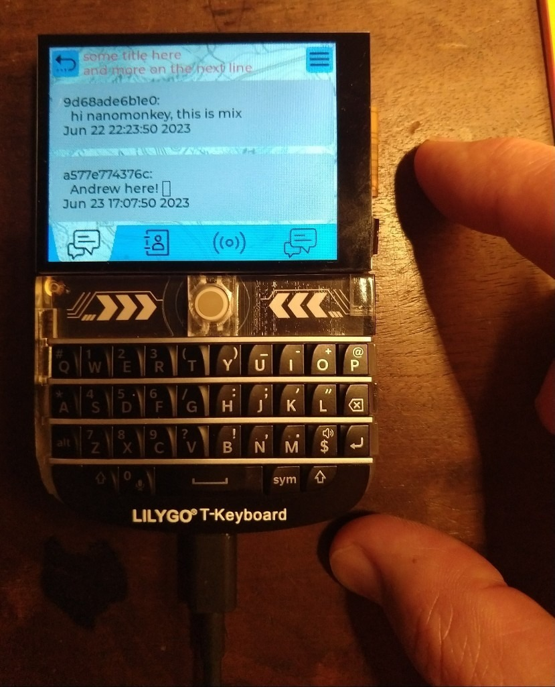
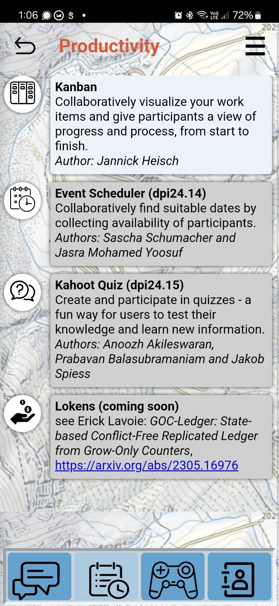
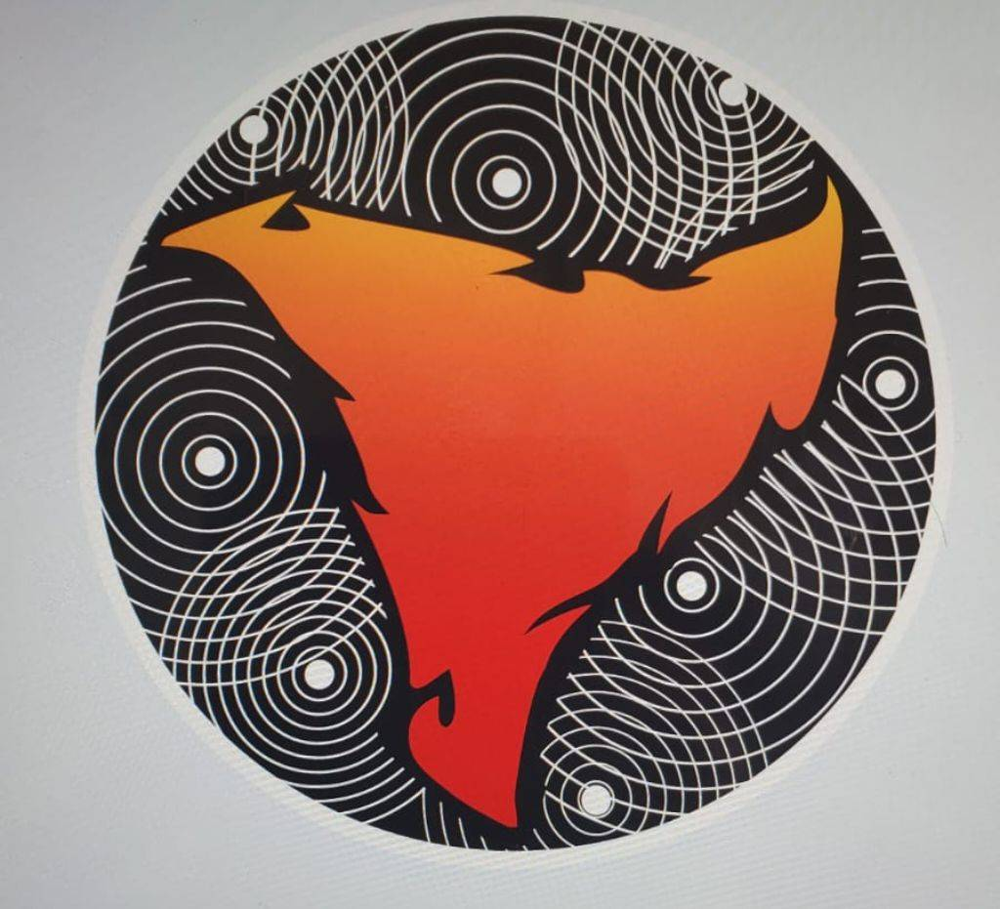
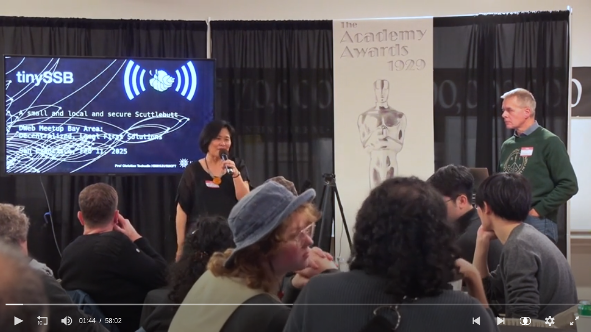

This project is a daughter of [Scuttlebutt](/p/scuttlebutt) -- it takes a similar
approach to signed, append-only logs, but radically modifies the format to fit
packets of 120 Bytes (including a cryptographic signature). This makes messaging
small enough to fit over [LoRa](https://en.wikipedia.org/wiki/LoRa), and
[Bluetooth Low-Energy](https://en.wikipedia.org/wiki/Bluetooth_Low_Energy).

<figure>
  
  <figcaption>
    Phones replicating with nearby T-Beams via BLE, which are in turn replicating
over great distances via LoRa
  </figcaption>
</figure>

The basic idea is you use your phone (or any device really) to publish messages
(text/ audio), and then those messages are replicated over long distances using
relays (for example using LoRa - a low power, radio protocol). Because all are
messages are cryptographically signed, we don't need to worry about trusting
intermediaries (relays, other peers). Other ways messages can be relayed is
directly from device-to-devices using Bluetooth Low Energy (requires zero
pairing, peers just need to be within a few meters, and be interested in what
each other are "saying")

:play_or_pause_button:
[video](https://archive.org/details/2025-02-11-d-web-dinner-meetup-v-003-full/2025-02-11+D-Web+Dinner+Meetup+v003+-+Christian+F+Tschudin-.mp4)

This project was created by [CFT](https://github.com/tschudin), and is an open
source collaboration which spans Switzerland, USA, New Zealand.

My contributions thus far have been:
- cheerleader
- beta tester / debugging
- documentation
- grant resourcing
- hosting regular meetings, [note-taking](https://github.com/tinySSB/meetings)
- leading the [specification](https://github.com/tinySSB/tiny-ssb-spec) writing

