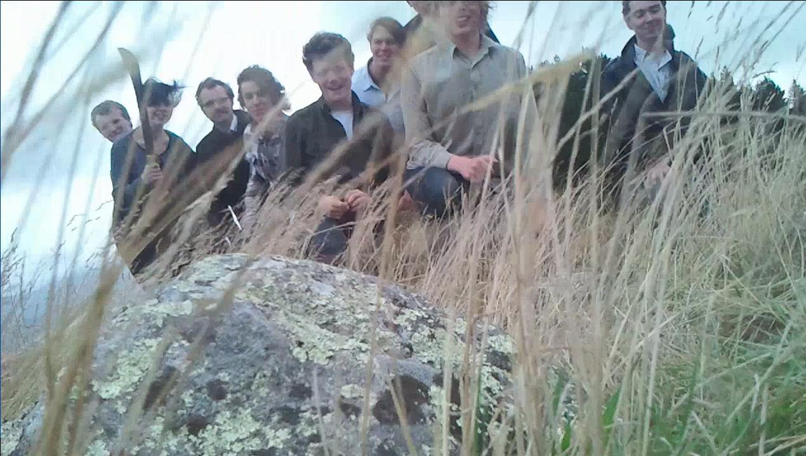
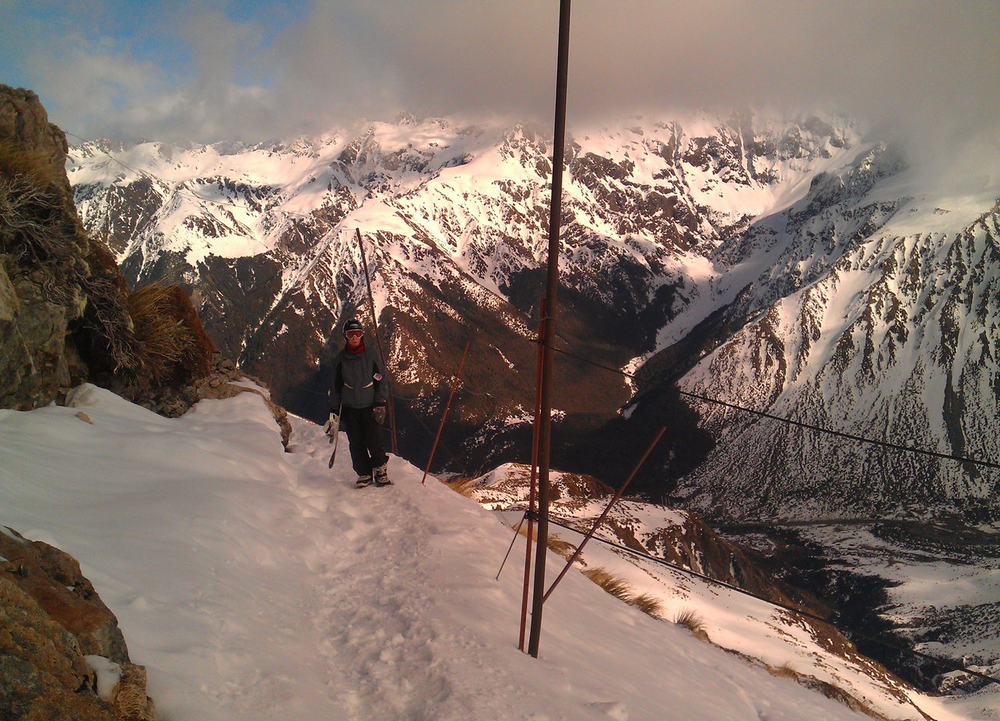
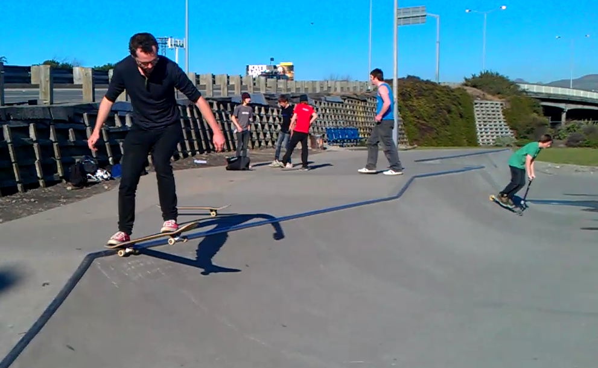
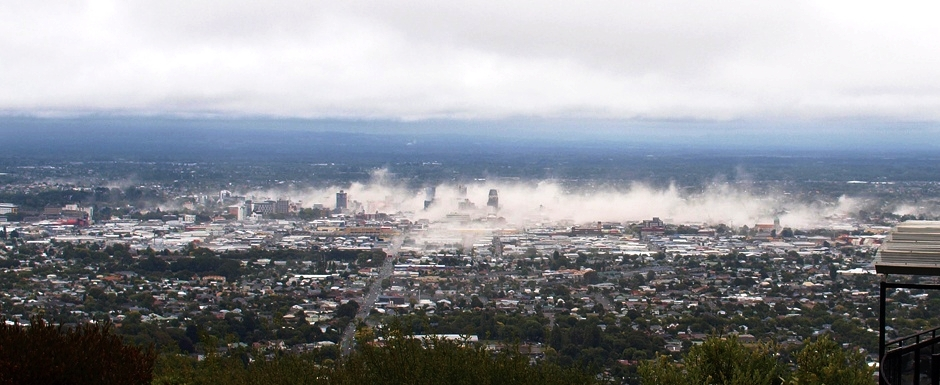

> :pencil: This is reposted from writing on Scuttlebutt.  
> :information_source: Unlimited Paenga Tawhiti is now [Ao Tawhiti](http://aotawhiti.school.nz/) after the earthquakes

## Intro

I enjoyed working as a tutor when I was at uni, so after some sloppy (failed)
post-grad maths research on blood splatter analysis, I decided to try out
teaching. The training was pretty meh, but I wandered into a skype call with
this place called Unlimited (some polytechnic or something?), anyway young
people telling us about producing albums, making videogames, managing their own
time and  talking like mature adults. Towards the end of the call it turned out
we'd been talking to highscool students as young as 14. I asked for a placement
there, and after doing practicum in the sort of place where people gave a fuck
about other people and supported actual learning I refused to take a job
anywhere else. 

So I lived in christchurch for 4 years and, and worked with some wonderful
learning advisors and some amazing young people.

## Vignettes

Some communities have a sort of magic that's a little hard to convey. I could
disect the anatomy / physics of this beautiful space (and I think about this a
lot!), but as an introduction I'll instead share a couple stories, because for me it's through interactions that the heart of a system is revealed.

### Trainee Teacher

I'm a trainee teacher in a maths class, there's a student swinging on their
chair and looking out the window. Here's the dialogue between the learning
advisor (Duncan) and the student (Hamish)

> **Duncan**: Hey Hamish, looks like you're not getting much done
> 
> **Hamish** : Nah, I've got this big event coming up this week which I'm
> thinking about (sport/ music? I can't remember)
> 
> **Duncan**: Oh that's cool! What's that about?
>
> _... 5 minutes of genuine conversation about shit that matters in Hamish's life_
>
> **Duncan**: Hey, so it sounds like you've got a bunch on. If you want to go
> have a nap or read a book under that tree, we can catch up on your maths
> later. Or if you'd like to give the maths a go, we've got another  15 minutes
> left of this class.

Things that stood out clear as day to me : 
- no bullshit authoritarianism, i.e. I was expecting _"DONT swing on your chair,
  GET BACK into focus!"_ (teacher training taught me that ~ 50% of the job is
  coercian / crowd control / acting)
- the 'student' was open and honest
- it was an even mature conversation
- the outcome was awesome, everyone won (was respected, and supporting the
  student's learning was 100% nailed)

### Real learning

Later, when I was an Learning Advisor (official role title, recenters "teachers"
as supporters, facillitaters, mentors), I had
a group of students who'd chosen to work with me (mostly nerds). On of them
(Harley) was keen to go skiing.

> **Harley**: hey Mix, can we go skiing?
>
> **Mix**: Yes, I'm happy to take you skiing if you figure out all the
> logistics and safety and stuff.
>
> **Harley**: ... ok, what do I need to do?
>
> **Mix**: I don't know, but we could talk to Peter, he does mountaineering
> courses and knows how to do risk assessments or whatever

So we went skiing. Responsibility was shared, Harley and friends learnt how to
budget, plan, and coordinate. We did similar things all the time, like making a
~VR headset with wii controllers, and building a RepRap (3d printer... this one
got interupted by the quake).

### Everyone is a teacher, everyone is a learner

Every wednesday afternoon the whole school would stop and do some sort of
excercise. The most minimal one was _Walking_ - we'd walk through the CBD and
around the gardens of Hagley Park (christchurch has a huge central park). My
first time out, I lost like 60% of the students, and was freaking out. When I
got back, my supervising teacher said "oh yeah, they'll have just walked home,
it's fine".

Later I ended up taking kids who wanted to go skateboarding to the skate park. I
didn't know how to skate at the time, and one day one of them said "Hey Mix,
you should learn how to drop in on the half-pipe".

Part of me was like _NOPE_ but the other part of me was like "You gotta do this,
it's really important you role model incompetance and perseverance in
learning". So they taught me very kindly and patiently how to skate. After a
month of this, we'd built a bunch of trust and the boys were asking what other
classes I took and genuinly sounded open to checking out stuff they wouldn't
otherwise have been into. You can grow curiosity. Relationships matter.

The school had a core mantra: **everyone is a teacher, everyone is a learner**.
This story kinda sums that up for me.

_Students also taught me to how to :lock: pick locks, :pizza: trade Bitcoin for pizza, :car: change the oil on my car, etc._

## Earthquakes

At the time of the quake, I was 2 blocks from the city center, on my way to a
teachers union meeting.

Major traumatic events do weird things to your perception and memory. I don't
remember how long the quake was (it was 30s to 2 minutes?), but I do remember
thinking I was having some sort of brain breakdown, or drugs, or ..  my vision
was fucked. The trees - giant oaks - were melting and waving ... so were the
lamp-posts. When the rolling stopped, I wondered if it had been a bomb. Where
before there was a block of buildings on one side of the park there was a
building sized cloud of dust..... it was a totally opaque wall of dust rising
into the sky.

To be honest, I paused before wondering if I should go back to the school -
maybe fuck everyone else? I figured trying carefully might be ok. By this time
the half dozen teachers I had been walking with, only 2 were still there. I
don't know where everyone went. For sure those with children of their own left
without pause at top speed. As we made our way back towards the school (a 4
storey building on the other side of the city square, 3 blocks away), we passed
people saying things like "The Cathedral is down". Not being inclinded to
investigate, the 3 of us set out to go the long way round. One of us decided to
cut through an arcade with a glass roof. I chose to take another street. There
wasn't much discussion.

I found two of my students in togs (swim-suits) with towels. I told them to put
their shoes on.

As we passed through taller buildings, there were sounds like rubble and glass
falling, and hissing ... like broken water mains, or was it gas? I had a weird
echo of experience playing FPS games -- I knew the rules, it was DO NOT stand
still, keep your head, and keep moving. 

Having people to look after helps a lot. As we walked there were people all
walking around on the road. Some were moving quickly, others were consoling
people crying. There were also people just standing and staring.

We found a train of students exiting the central city, being guided by teachers
(there were only 4 adults in the school of 400 over the lunch because of the
union meeting). I become a redirection node, like in that classic game
lemmings. I found myself directing adults who were wandering as well.

We ultimately joined the train, and made our way to a nearby park. As we went,
the students in the towles (I think?) asked me "are those people ok?". I said I
didn't know, and that we needed to keep moving. I was later told we walked past
people bleeding from injuries, and past bodies being pulled from the rubble. We
also walked passed a film studio where my girlfriends flatmate worked. It was
flat. Of the 4-5 storeys, there was nothing but the stairwell. He died in there,
along with dozens of others. I remember seeing that, and the noxious smoke
coming out of the rubble, but I don't remember seeing any dead.

We got to the small park (2 small city blocks in size), and started to try to
take stock. I understand more how and why the romans organised they did (under
standards/flags, with command-tents, and information runners). It was pretty
chaotic. Try organising ~400 people with no spatial physical system. Hierarchy
and layers of responsibility become really valuable. Over time a triage center
and helipad were set up down one end of the park. I stayed till dark as friends
and family picked up children. We took food from the nearby supermarket I think?

I met up with my girlfriend, we walked through the deserted streets. Down one
street cars were half sunk into the road like the ground was quicksand
(liquifaction).

I didn't know if my house was still standing. The tunnel to Lyttelton was
closed. The next day, 4 of us decided to risk driving over the hill. We passed a
house that had a hole the size of a truck through the middle where a boulder had
passed straight through.

Our old wooden flat was fine, but there was no running water for days. We shat
in plastic bags for a bit, but soon dug a shit pit to squat in. There was a huge
tanker of water brought in and parked down in the center of our little town. You
could go get buckets or bottles filled down there. Civilisation gets pretty
intense pretty quick without water.  

I'll write about the damage to the social fabric later.

## More learning

I stayed a year (or more?) after the quake. The school was seriously disrupted (moved half-way across the city, sharing with another school), my relationship broke up, I did some therapy.

I was in my 20s, and I'd just poured 4 years of my life and soul into lifting up
others learning and lives. I wanted to do some of that for myself, so I decided
to move to Wellington and attend Art School.

## Reflections

I think Unlimited did a great job of wrapping support and guidance around
students. It wasn't an environment which worked for everyone. I think if I was
to change one thing given years of perspective, it would be to weave more
collectivism into the spirit of the place -- extend the focus beyond _"what's my
learning pathway?"_ towards _**"what can we achieve together?"**_.

Unlimited forever changed how I see institutions and learning. I was
radicalized... am now forever an advocate for holistic education, of systems
which embed care. I wouldn't change a thing about that, but it's also a
heart-breaking burden to bear sometimes.

