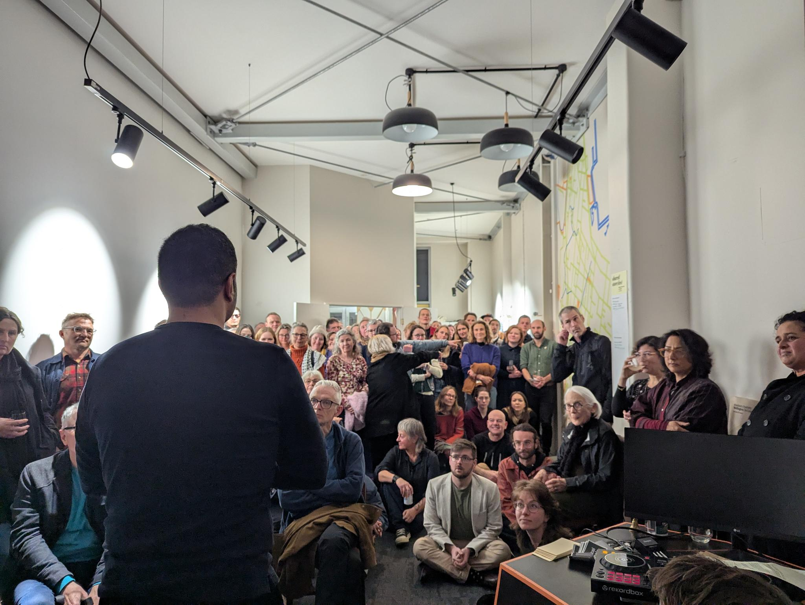
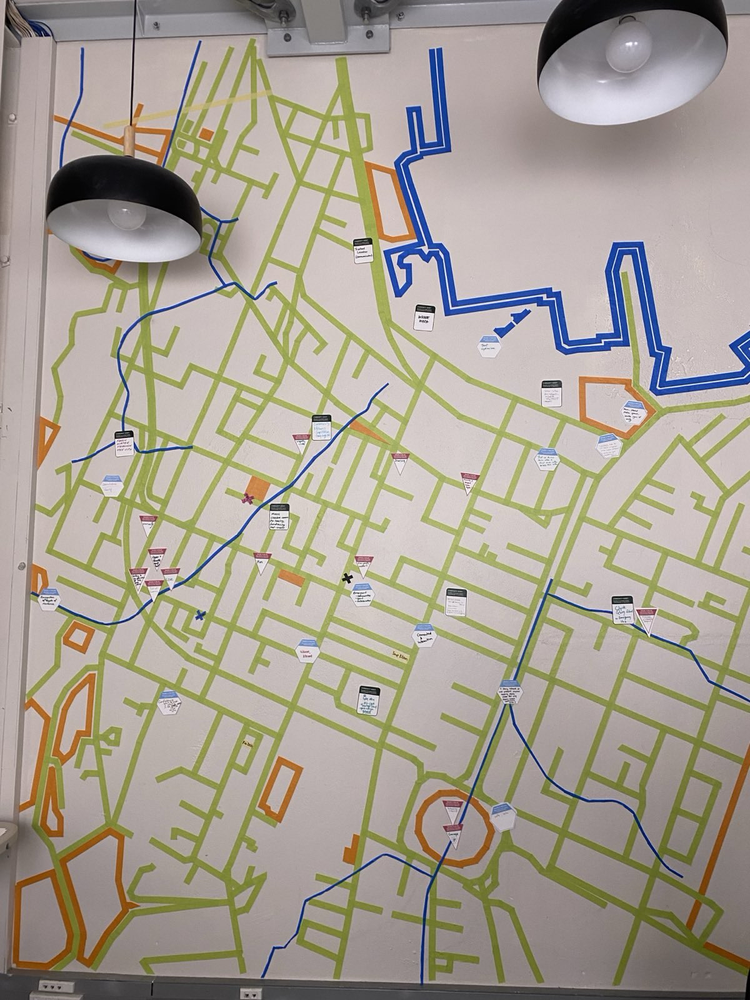
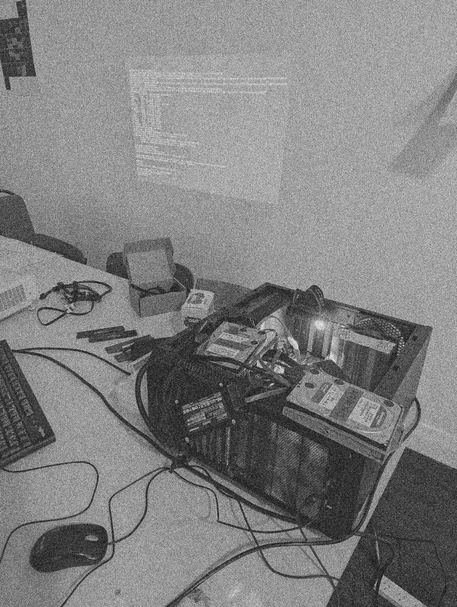
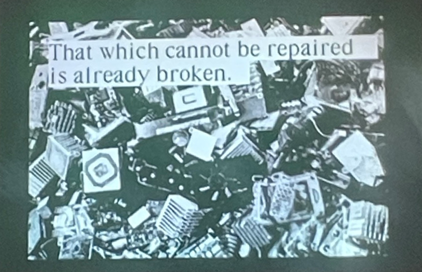
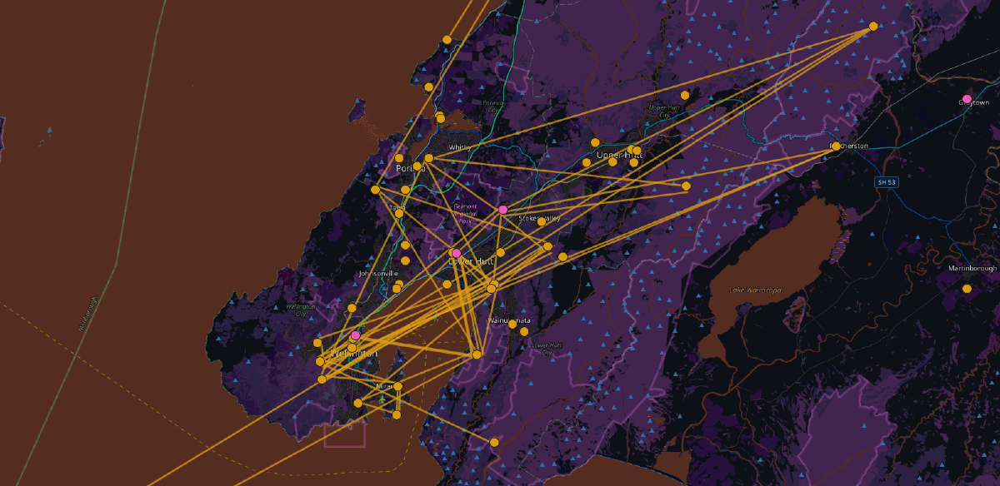
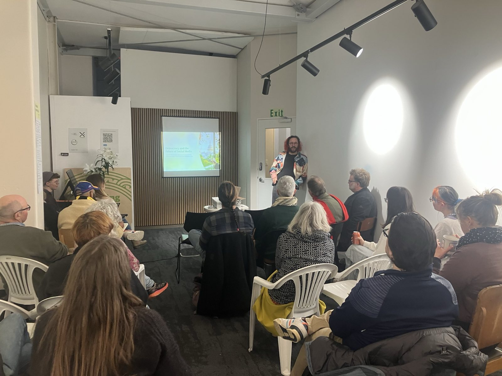

This evolved from last years successful [Beautiful
Signals](/project/beautiful-signals/). A 3 months long community space
hosted in Pōneke / Wellington in partnership with the Goethe
Institute, several universities, and many community memebers.

I built and maintained the [website](criticalsignals.nz) in collaboration with infrastructure by [nikau.io](https://nikau.io/).

